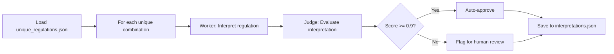

# Unique Regulations Extraction & Interpretation Plan

## Overview

This document provides a complete implementation plan for extracting unique regulation combinations, processing them through gemini-2.0-flash, and creating a "dumb pipe" lookup system.

## Phase 1: Extract Unique Combinations

### Script: `backend/extract_unique_regulations.py`

**Purpose:** Extract and deduplicate parking regulations based on semantic field combinations.

**Key Functions:**

```python
def create_unique_key(reg: Dict[str, Any]) -> str:
    """
    Create unique key based on:
    - regulation (text)
    - days (M-F, Daily, etc.)
    - hours (time windows)
    - hrlimit (time limit)
    - rpparea1 (RPP zone)
    
    EXCLUDE: cnn, geometry, addresses (location-specific)
    """
    key_fields = {
        'regulation': reg.get('regulation', '').strip().upper(),
        'days': reg.get('days', '').strip().upper(),
        'hours': reg.get('hours', '').strip(),
        'hrlimit': reg.get('hrlimit'),
        'rpparea1': reg.get('rpparea1', '').strip().upper(),
    }
    return hashlib.md5(json.dumps(key_fields, sort_keys=True).encode()).hexdigest()
```

**Output Format:** `unique_regulations.json`

```json
{
  "metadata": {
    "total_regulations": 7000,
    "unique_combinations": 500,
    "deduplication_ratio": "93.0%",
    "extracted_at": "2025-11-30T22:17:00Z"
  },
  "unique_combinations": [
    {
      "unique_id": "abc123def456...",
      "fields": {
        "regulation": "TIME LIMITED",
        "days": "M-F",
        "hours": "0800-1800",
        "hrlimit": 2,
        "rpparea1": "W"
      },
      "usage_count": 143,
      "sample_object_ids": [
        "507f1f77bcf86cd799439011",
        "507f191e810c19729de860ea",
        "507f1f77bcf86cd799439012"
      ],
      "all_object_ids": ["...full list..."]
    }
  ]
}
```

**Implementation Steps:**

1. Connect to MongoDB
2. Fetch all parking_regulations
3. Group by unique_key
4. For each group, store:
   - Unique field combination
   - Count of regulations using this combination
   - First 3 ObjectIds (for quick review)
   - All ObjectIds (for mapping)
5. Export to JSON with statistics

**Run Command:**
```bash
cd backend
python extract_unique_regulations.py
```

---

## Phase 2: Process Through gemini-2.0-flash

### Script: `backend/process_unique_interpretations.py`

**Purpose:** Send unique combinations through Worker → Judge pipeline using gemini-2.0-flash.

**Model Configuration:**

```python
import google.generativeai as genai

# Configure gemini-2.0-flash
genai.configure(api_key=os.getenv("GOOGLE_API_KEY"))
model = genai.GenerativeModel('gemini-2.0-flash-exp')

# Rate limiting for free tier
RATE_LIMIT_RPM = 15  # Requests per minute
DELAY_BETWEEN_CALLS = 4  # seconds
```

**Processing Flow:**



**Output Format:** `regulation_interpretations.json`

```json
{
  "metadata": {
    "processed_at": "2025-11-30T23:00:00Z",
    "model": "gemini-2.0-flash-exp",
    "total_processed": 500,
    "auto_approved": 450,
    "flagged_for_review": 50
  },
  "interpretations": [
    {
      "unique_id": "abc123def456...",
      "source_fields": {
        "regulation": "TIME LIMITED",
        "days": "M-F",
        "hours": "0800-1800",
        "hrlimit": 2,
        "rpparea1": "W"
      },
      "worker_output": {
        "action": "time-limited",
        "summary": "2 Hour Parking Mon-Fri 8am-6pm except Permit W",
        "severity": "medium",
        "conditions": {
          "time_limit": 120,
          "days": ["Mon", "Tue", "Wed", "Thu", "Fri"],
          "hours": "8am-6pm",
          "exceptions": ["Permit W"]
        }
      },
      "judge_evaluation": {
        "score": 0.95,
        "reasoning": "Accurate interpretation with correct time limits and permit exception",
        "flagged": false
      },
      "usage_count": 143,
      "object_ids": ["507f1f77bcf86cd799439011", "..."]
    }
  ]
}
```

**Implementation Steps:**

1. Load `unique_regulations.json`
2. For each unique combination:
   - Call Worker LLM with regulation fields
   - Call Judge LLM with Worker output
   - Store results with score
   - Apply rate limiting (4 seconds between calls)
3. Export results with approval status
4. Generate summary statistics

**Run Command:**
```bash
cd backend
python process_unique_interpretations.py
```

**Estimated Time:** 500 combinations × 4 seconds = ~33 minutes

---

## Phase 3: Human Review Interface

### Script: `backend/review_flagged_interpretations.py`

**Purpose:** Interactive CLI for reviewing flagged interpretations (score < 0.9).

**Features:**

1. Display regulation fields and Worker interpretation
2. Show Judge's reasoning for flagging
3. Allow human to:
   - Approve as-is
   - Edit interpretation
   - Mark as special case
4. Update `regulation_interpretations.json` with corrections

**Example Review Session:**

```
=== Flagged Interpretation 1 of 50 ===

Source Fields:
  regulation: "Limited No Parking"
  days: "Daily"
  hours: "2400-600"
  hrlimit: null
  rpparea1: null

Worker Interpretation:
  action: "prohibited"
  summary: "No Parking Daily 12am-6am"
  severity: "high"

Judge Score: 0.75
Judge Reasoning: "Text says 'Limited' but interpretation says absolute prohibition"

Sample ObjectIds: 507f1f77bcf86cd799439011, 507f191e810c19729de860ea

Options:
  [A] Approve as-is
  [E] Edit interpretation
  [S] Mark as special case
  [V] View full regulation in database
  [Q] Quit and save progress

Your choice:
```

---

## Phase 4: Create Interpretation Cache

### Script: `backend/create_interpretation_cache.py`

**Purpose:** Load approved interpretations into MongoDB as a lookup cache.

**New Collection:** `regulation_interpretations`

**Schema:**

```javascript
{
  "_id": "abc123def456...",  // unique_id from extraction
  "source_fields": {
    "regulation": "TIME LIMITED",
    "days": "M-F",
    "hours": "0800-1800",
    "hrlimit": 2,
    "rpparea1": "W"
  },
  "interpreted": {
    "action": "time-limited",
    "summary": "2 Hour Parking Mon-Fri 8am-6pm except Permit W",
    "severity": "medium",
    "conditions": {...},
    "confidence_score": 0.95,
    "judge_verified": true
  },
  "metadata": {
    "usage_count": 143,
    "created_at": "2025-11-30T23:00:00Z",
    "model": "gemini-2.0-flash-exp",
    "human_verified": true,
    "last_updated": "2025-11-30T23:30:00Z"
  }
}
```

**Indexes:**

```python
# Create indexes for fast lookup
await db.regulation_interpretations.create_index("_id")
await db.regulation_interpretations.create_index("source_fields.regulation")
```

---

## Phase 5: Update Parking Regulations Collection

### Script: `backend/link_regulations_to_interpretations.py`

**Purpose:** Add `interpretation_ref` field to all parking_regulations.

**Update Logic:**

```python
for reg in parking_regulations:
    unique_key = create_unique_key(reg)
    
    # Update regulation with reference
    await db.parking_regulations.update_one(
        {"_id": reg["_id"]},
        {"$set": {"interpretation_ref": unique_key}}
    )
```

**Updated Schema:**

```javascript
// parking_regulations collection
{
  "_id": ObjectId("507f1f77bcf86cd799439011"),
  "cnn": "1046000",
  "regulation": "TIME LIMITED",
  "days": "M-F",
  "hours": "0800-1800",
  "hrlimit": 2,
  "rpparea1": "W",
  "geometry": {...},
  "interpretation_ref": "abc123def456..."  // NEW FIELD
}
```

---

## Phase 6: Update API Endpoints

### File: `backend/main.py`

**New Endpoint:** `GET /api/v1/interpretations/{unique_id}`

```python
@app.get("/api/v1/interpretations/{unique_id}")
async def get_interpretation(unique_id: str):
    """Fetch cached interpretation by unique_id."""
    interpretation = await db.regulation_interpretations.find_one(
        {"_id": unique_id}
    )
    if not interpretation:
        raise HTTPException(status_code=404, detail="Interpretation not found")
    return interpretation
```

**Updated Endpoint:** `GET /api/v1/blockfaces`

```python
async def get_blockfaces(lat: float, lng: float, radius_meters: int):
    # ... existing geospatial query ...
    
    # For each regulation, fetch interpretation
    for segment in segments:
        for rule in segment.get("rules", []):
            if rule.get("type") == "parking-regulation":
                interp_ref = rule.get("interpretation_ref")
                if interp_ref:
                    # Dumb pipe lookup
                    interpretation = await db.regulation_interpretations.find_one(
                        {"_id": interp_ref}
                    )
                    rule["interpreted"] = interpretation.get("interpreted")
    
    return segments
```

---

## Phase 7: Performance Optimization

### Caching Strategy

**Option A: In-Memory Cache (Recommended)**

```python
from functools import lru_cache

# Cache all 500 interpretations in memory at startup
interpretation_cache = {}

@app.on_event("startup")
async def load_interpretation_cache():
    global interpretation_cache
    interpretations = await db.regulation_interpretations.find({}).to_list(None)
    interpretation_cache = {i["_id"]: i["interpreted"] for i in interpretations}
    print(f"✅ Loaded {len(interpretation_cache)} interpretations into memory")

# Lookup becomes O(1)
def get_cached_interpretation(unique_id: str):
    return interpretation_cache.get(unique_id)
```

**Memory Usage:** 500 interpretations × ~1KB each = ~500KB (negligible)

**Option B: Redis Cache (If scaling beyond single server)**

```python
import redis

redis_client = redis.Redis(host='localhost', port=6379, db=0)

# Store interpretations in Redis
for interp in interpretations:
    redis_client.set(
        f"interp:{interp['_id']}", 
        json.dumps(interp["interpreted"]),
        ex=86400  # 24 hour TTL
    )
```

---

## Success Metrics

### Before (Current System)
- LLM calls per user query: 20 (one per regulation)
- Response time: 1-2 seconds (LLM latency)
- Monthly cost at 1K users: $60
- Consistency: Variable (same regulation may get different interpretations)

### After (Unique Combinations + Dumb Pipe)
- LLM calls per user query: 0 (pre-computed)
- Response time: <5ms (memory lookup)
- Monthly cost at 1K users: $0 (one-time $0.05 processing cost)
- Consistency: Perfect (same regulation always gets same interpretation)

---

## Implementation Checklist

### Week 1: Extraction & Processing
- [ ] Create `extract_unique_regulations.py`
- [ ] Run extraction, verify ~500 unique combinations
- [ ] Create `process_unique_interpretations.py`
- [ ] Configure gemini-2.0-flash-exp API
- [ ] Process all 500 combinations (~33 minutes)
- [ ] Review output statistics

### Week 2: Review & Cache
- [ ] Create `review_flagged_interpretations.py`
- [ ] Human review of flagged items (score < 0.9)
- [ ] Create `create_interpretation_cache.py`
- [ ] Load approved interpretations into MongoDB
- [ ] Create `link_regulations_to_interpretations.py`
- [ ] Update all parking_regulations with `interpretation_ref`

### Week 3: API Integration
- [ ] Update `main.py` with new endpoints
- [ ] Implement in-memory cache loading
- [ ] Update blockfaces endpoint to use cached interpretations
- [ ] Test API performance (<5ms lookups)
- [ ] Update frontend to display interpreted data

### Week 4: Validation & Documentation
- [ ] Run end-to-end tests
- [ ] Verify consistency across identical regulations
- [ ] Measure performance improvements
- [ ] Document interpretation dictionary
- [ ] Create cache invalidation strategy

---

## Cache Invalidation Strategy

### Trigger: SFMTA Data Update

When new parking regulation data is released:

1. **Detect Changes:**
   ```python
   new_regulations = fetch_from_sfmta()
   for reg in new_regulations:
       unique_key = create_unique_key(reg)
       if unique_key not in interpretation_cache:
           # New combination detected
           process_new_combination(reg)
   ```

2. **Process New Combinations:**
   - Run through Worker → Judge pipeline
   - Add to interpretation cache
   - Update affected regulations

3. **Version Control:**
   ```javascript
   {
     "_id": "abc123...",
     "version": 2,
     "previous_versions": [
       {
         "version": 1,
         "interpreted": {...},
         "deprecated_at": "2025-12-01"
       }
     ],
     "interpreted": {...}  // Current version
   }
   ```

---

## Cost Analysis

### One-Time Processing Cost

**Using gemini-2.0-flash-exp:**
- Input tokens per regulation: ~200 tokens
- Output tokens per interpretation: ~300 tokens
- Total per regulation: ~500 tokens
- Cost per 1M tokens: $0.075 (input) + $0.30 (output)

**Calculation:**
```
500 unique combinations × 500 tokens = 250,000 tokens
250,000 tokens × $0.000375/token = $0.09375

Total one-time cost: ~$0.10
```

### Runtime Cost

**Per user query:**
- LLM calls: 0
- Database lookups: 20 (one per regulation)
- Memory lookups: 20 (if using in-memory cache)
- Cost: $0.00

**Monthly cost at 1M users:**
- LLM cost: $0.00
- Infrastructure: Standard MongoDB/hosting costs
- Total incremental cost: $0.00

---

## Next Steps

To implement this plan:

1. **Switch to Code mode** to create the Python scripts
2. **Run extraction** to verify ~500 unique combinations
3. **Review sample data** to ensure deduplication logic is correct
4. **Process through gemini-2.0-flash** with rate limiting
5. **Human review** of flagged interpretations
6. **Deploy to production** with in-memory caching

Would you like me to switch to Code mode to begin implementation?