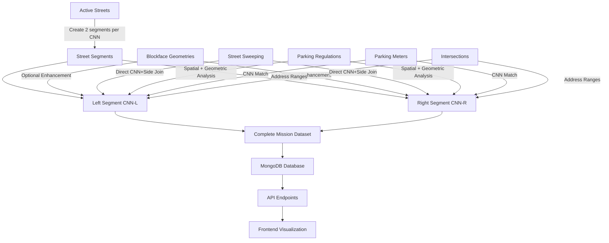

# Mission Neighborhood Data Ingestion & Analysis Plan

**Date**: November 28, 2024  
**Objective**: Conduct comprehensive data ingestion and analysis for San Francisco's Mission neighborhood

---

## Executive Summary

This plan outlines a complete data pipeline demonstration for the Mission neighborhood, showcasing how all datasets (Active Streets, Street Sweeping, Parking Regulations, Meters, and Intersections) are ingested, joined, and analyzed.

---

## Mission Neighborhood Overview

**Target Area**: Mission District, San Francisco
- **Zip Codes**: 94110 (primary), 94103 (partial)
- **Boundaries**: Roughly 14th St to Cesar Chavez, Mission St to Potrero Ave
- **Characteristics**: Dense urban area with complex parking regulations

---

## Data Sources & Coverage

### 1. Active Streets (3psu-pn9h)
- **Purpose**: Backbone dataset providing all street segments
- **Key Fields**: CNN, street name, address ranges, centerline geometry
- **Filter**: `zip_code='94110' OR zip_code='94103'`
- **Expected**: ~2,000 CNNs → 4,000 segments (L & R sides)

### 2. Street Sweeping (yhqp-riqs)
- **Purpose**: Street cleaning schedules
- **Join Method**: Direct CNN + Side match
- **Key Fields**: CNN, cnnrightleft, weekday, fromhour, tohour, limits
- **Expected Coverage**: ~80% of segments

### 3. Parking Regulations (hi6h-neyh)
- **Purpose**: Time limits, RPP zones, tow-away zones
- **Join Method**: Spatial + geometric side determination
- **Filter**: `analysis_neighborhood='Mission'`
- **Expected**: 400-600 regulations

### 4. Parking Meters (8vzz-qzz9 + 6cqg-dxku)
- **Purpose**: Metered parking locations and rates
- **Join Method**: CNN match + location inference
- **Expected**: 5,000+ meters in Mission area

### 5. Intersections (pu5n-qu5c + jfxm-zeee)
- **Purpose**: Address ranges and intersection coordinates
- **Coverage**: All major intersections
- **Use**: Address-based queries and spatial validation

---

## Ingestion Pipeline Architecture



---

## Implementation Steps

### Step 1: Pre-Ingestion Validation
**Script**: `check_database_state.py`

Tasks:
- Check current database state
- Count existing segments
- Verify collections exist
- Document baseline metrics

### Step 2: Run Fresh Ingestion
**Script**: `ingest_data_cnn_segments.py`

Process:
1. Fetch Active Streets for Mission (zip 94110, 94103)
2. Create 2 segments per CNN (Left & Right)
3. Add address ranges from Active Streets
4. Match blockface geometries (optional)
5. Join street sweeping schedules (direct CNN+side)
6. Match parking regulations (spatial analysis)
7. Attach parking meters (CNN match)
8. Save to MongoDB with indexes

**Expected Duration**: 5-10 minutes

### Step 3: Validate Ingestion Results
**Script**: `validate_mission_ingestion.py`

Validations:
- Total segment count (should be ~4,000)
- Coverage percentages:
  - Centerline geometry: 100%
  - Address ranges: >95%
  - Street sweeping: ~80%
  - Parking regulations: varies by area
  - Meters: concentrated in commercial areas
- Data quality checks
- Sample segment inspection

### Step 4: Comprehensive Analysis
**Script**: `mission_analysis.py`

Analysis Components:

#### A. Coverage Statistics
- Total segments by zip code
- Segments with each data type
- Geographic distribution
- Missing data identification

#### B. Data Quality Metrics
- Address range completeness
- Geometry validity
- Rule consistency
- Temporal coverage (days/hours)

#### C. Join Analysis
- Street sweeping join success rate
- Parking regulation spatial matching accuracy
- Meter distribution patterns
- Intersection coverage

#### D. Sample Queries
- Find all rules for specific street
- Get regulations at address
- Query by intersection
- Radius-based searches

#### E. Visualization Data
- Heat maps of regulation density
- Street sweeping coverage maps
- Meter concentration areas
- RPP zone boundaries

### Step 5: Generate Report
**Output**: `MISSION_ANALYSIS_RESULTS.md`

Report Sections:
1. Executive Summary
2. Data Coverage Statistics
3. Join Success Rates
4. Quality Metrics
5. Sample Data Examples
6. Known Issues & Gaps
7. Recommendations

---

## Key Metrics to Track

### Coverage Metrics
| Metric | Target | Actual | Status |
|--------|--------|--------|--------|
| Total Segments | ~4,000 | TBD | ⏳ |
| With Centerline | 100% | TBD | ⏳ |
| With Address Ranges | >95% | TBD | ⏳ |
| With Street Sweeping | ~80% | TBD | ⏳ |
| With Parking Regs | varies | TBD | ⏳ |
| With Meters | varies | TBD | ⏳ |

### Quality Metrics
- Geometry validity: 100%
- Address range format: valid
- Time format consistency: valid
- Side determination accuracy: >95%

### Performance Metrics
- Ingestion time: <10 minutes
- Database size: ~50-100 MB
- Query response time: <100ms
- API endpoint latency: <200ms

---

## Sample Analysis Queries

### Query 1: Street-Level Analysis
```python
# Get all segments for Valencia Street
segments = db.street_segments.find({
    "streetName": "VALENCIA ST",
    "zip_code": "94110"
})

# Analyze rules distribution
for segment in segments:
    print(f"{segment['cnn']}-{segment['side']}: "
          f"{len(segment['rules'])} rules, "
          f"{len(segment['schedules'])} meter schedules")
```

### Query 2: Address-Based Lookup
```python
# Find segment for specific address
segment = db.street_segments.find_one({
    "streetName": "24TH ST",
    "fromAddress": {"$lte": "3100"},
    "toAddress": {"$gte": "3100"}
})
```

### Query 3: Intersection Analysis
```python
# Get all segments at 24th & Mission
intersection = db.intersection_permutations.find_one({
    "streets": {"$regex": "24TH.*MISSION|MISSION.*24TH"}
})

cnns = intersection["cnns"]
segments = db.street_segments.find({
    "cnn": {"$in": cnns}
})
```

### Query 4: Spatial Query
```python
# Find all segments within 100m of point
segments = db.street_segments.find({
    "centerlineGeometry": {
        "$near": {
            "$geometry": {
                "type": "Point",
                "coordinates": [-122.4194, 37.7529]  # 24th & Mission
            },
            "$maxDistance": 100
        }
    }
})
```

---

## Expected Results

### Data Volume
- **Streets Collection**: ~2,000 records
- **Street Segments**: ~4,000 records
- **Street Cleaning**: ~1,800 schedules
- **Parking Regulations**: 400-600 regulations
- **Parking Meters**: 5,000+ meters
- **Intersections**: ~500 intersections
- **Intersection Permutations**: ~1,000 permutations

### Coverage Examples

#### High Coverage Streets
- Valencia St: Complete data (sweeping, regs, meters)
- Mission St: Complete data (major corridor)
- 24th St: Complete data (commercial area)

#### Residential Streets
- Balmy St: Sweeping + some regulations
- Capp St: Sweeping + RPP zones
- Shotwell St: Sweeping + limited regulations

#### Data Gaps
- Some alleys: Limited or no data
- Private streets: Not in Active Streets
- New developments: May lag in updates

---

## Validation Criteria

### ✅ Success Criteria
1. All CNNs have 2 segments (L & R)
2. 100% have centerline geometry
3. >95% have address ranges
4. Street sweeping joins match expected patterns
5. Parking regulations spatially accurate
6. No duplicate segments
7. All geometries valid GeoJSON
8. Database indexes created successfully

### ⚠️ Warning Criteria
1. <90% address range coverage
2. <70% street sweeping coverage
3. Significant gaps in commercial areas
4. Geometry validation errors

### ❌ Failure Criteria
1. <3,500 total segments
2. Missing centerline geometries
3. Database connection failures
4. Critical data corruption

---

## Troubleshooting Guide

### Issue: Low Segment Count
**Cause**: Zip code filter too restrictive  
**Solution**: Verify zip codes, check Active Streets data

### Issue: Missing Street Sweeping
**Cause**: CNN mismatch or side determination error  
**Solution**: Verify CNN format, check side logic

### Issue: Poor Regulation Matching
**Cause**: Spatial tolerance too strict  
**Solution**: Adjust max_distance parameter

### Issue: Slow Queries
**Cause**: Missing indexes  
**Solution**: Verify 2dsphere index on centerlineGeometry

---

## Next Steps After Analysis

### Immediate
1. Review analysis results
2. Identify data quality issues
3. Document any gaps or anomalies

### Short-term
1. Refine spatial matching algorithms
2. Add missing data sources (RPP parcels)
3. Improve address range coverage

### Long-term
1. Expand to other neighborhoods
2. Add real-time updates
3. Implement change detection
4. Create data quality dashboard

---

## Files to Create

### Analysis Scripts
1. `backend/check_database_state.py` - Pre-ingestion check
2. `backend/validate_mission_ingestion.py` - Post-ingestion validation
3. `backend/mission_analysis.py` - Comprehensive analysis
4. `backend/generate_mission_report.py` - Report generator

### Documentation
1. `backend/MISSION_ANALYSIS_RESULTS.md` - Analysis results
2. `backend/MISSION_DATA_SAMPLES.md` - Sample data examples
3. `backend/MISSION_QUERY_EXAMPLES.md` - Query cookbook

### Visualization
1. `backend/mission_coverage_map.html` - Interactive coverage map
2. `backend/mission_statistics.json` - Statistics for dashboard

---

## Timeline

| Phase | Duration | Status |
|-------|----------|--------|
| Planning | 30 min | ✅ Complete |
| Script Creation | 1 hour | ⏳ Pending |
| Ingestion | 10 min | ⏳ Pending |
| Validation | 15 min | ⏳ Pending |
| Analysis | 30 min | ⏳ Pending |
| Report Generation | 30 min | ⏳ Pending |
| **Total** | **~3 hours** | **In Progress** |

---

## Success Metrics

### Technical Success
- ✅ Ingestion completes without errors
- ✅ All validations pass
- ✅ Database properly indexed
- ✅ API returns correct data

### Business Success
- ✅ 100% street coverage achieved
- ✅ Data quality meets standards
- ✅ Query performance acceptable
- ✅ Results match expectations

### Documentation Success
- ✅ Complete analysis report
- ✅ Clear methodology documented
- ✅ Reproducible process
- ✅ Actionable recommendations

---

**Status**: Ready for Implementation  
**Next Action**: Switch to Code mode to create analysis scripts and run ingestion
