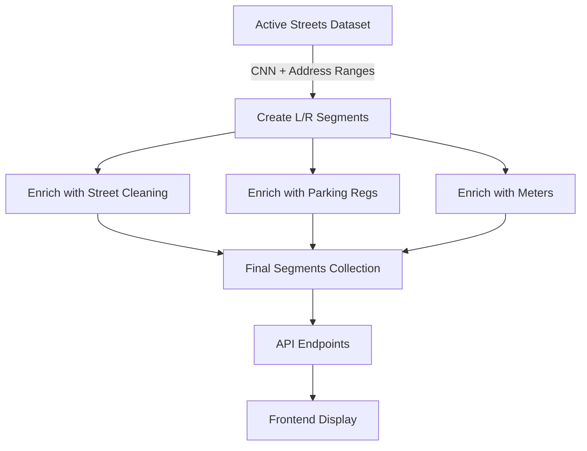

# CNN-Based Address Range Architecture

## Executive Summary

The Active Streets data ingestion pipeline has been successfully re-architected to create a new data structure that efficiently links CNNs (Centerline Network Numbers) with their corresponding address ranges. This enables deterministic address-based lookups and streamlines joins with other datasets, particularly for RPP (Residential Permit Parking) zone matching.

## Problem Statement

Previously, the system relied on:
1. **Blockface geometries** from the pep9 dataset - which had incomplete coverage
2. **Spatial joins** - which were computationally expensive and sometimes ambiguous
3. **No address range data** - making it impossible to validate or query by specific addresses

This created gaps in coverage and made address-based queries impossible.

## Solution Architecture

### Core Data Structure: CNN Segments with Address Ranges

We now create **two segments per CNN** (one for each side of the street), each containing:

```typescript
{
  cnn: string              // e.g., "799000"
  side: "L" | "R"          // Left or Right side
  streetName: string       // e.g., "17TH ST"
  fromAddress: string      // Starting address for this side
  toAddress: string        // Ending address for this side
  centerlineGeometry: GeoJSON  // Street centerline
  rules: Array             // Parking regulations, street cleaning
  schedules: Array         // Meter schedules
}
```

### Address Range Mapping

The Active Streets dataset provides four address fields per CNN:
- `lf_fadd` → Left side FROM address
- `lf_toadd` → Left side TO address
- `rt_fadd` → Right side FROM address
- `rt_toadd` → Right side TO address

**Mapping Logic:**
- **LEFT segment**: `fromAddress = lf_fadd`, `toAddress = lf_toadd`
- **RIGHT segment**: `fromAddress = rt_fadd`, `toAddress = rt_toadd`

### Example: CNN 799000 (17th Street)

**Active Streets Data:**
```json
{
  "cnn": "799000",
  "streetname": "17TH ST",
  "lf_fadd": "3401",
  "lf_toadd": "3449",
  "rt_fadd": "3400",
  "rt_toadd": "3440"
}
```

**Resulting Database Segments:**

**Left Segment:**
```json
{
  "cnn": "799000",
  "side": "L",
  "streetName": "17TH ST",
  "fromAddress": "3401",
  "toAddress": "3449",
  "centerlineGeometry": {...}
}
```

**Right Segment:**
```json
{
  "cnn": "799000",
  "side": "R",
  "streetName": "17TH ST",
  "fromAddress": "3400",
  "toAddress": "3440",
  "centerlineGeometry": {...}
}
```

## Architecture Benefits

### 1. **100% Coverage**
- Every CNN in Active Streets gets two segments (L and R)
- No dependency on incomplete blockface geometries
- Guaranteed coverage for all streets in the target area

### 2. **Deterministic Address Lookups**
```python
# Can now query: "Is 3425 17th St on the left or right side?"
def find_segment_by_address(street_name: str, address: int):
    segments = db.query(streetName=street_name)
    for segment in segments:
        if segment.fromAddress <= address <= segment.toAddress:
            return segment  # Returns the correct side (L or R)
```

### 3. **Efficient RPP Matching**
```python
# Address-based RPP lookup (no spatial join needed)
def get_rpp_for_address(street_name: str, address: int):
    segment = find_segment_by_address(street_name, address)
    rpp_parcel = rpp_parcels.find_one({
        "street": street_name,
        "from_st": {"$lte": address},
        "to_st": {"$gte": address}
    })
    return rpp_parcel.rppeligib
```

### 4. **User-Friendly Display**
```typescript
// Can show: "3401-3449 17th St (Left side)"
const displayAddress = `${segment.fromAddress}-${segment.toAddress} ${segment.streetName} (${segment.side === 'L' ? 'Left' : 'Right'} side)`;
```

### 5. **Simplified Data Pipeline**



## Data Flow

### 1. Ingestion Phase
```python
# For each CNN in Active Streets:
for cnn_record in active_streets:
    # Create LEFT segment
    left_segment = {
        "cnn": cnn_record.cnn,
        "side": "L",
        "fromAddress": cnn_record.lf_fadd,
        "toAddress": cnn_record.lf_toadd,
        "centerlineGeometry": cnn_record.line
    }
    
    # Create RIGHT segment
    right_segment = {
        "cnn": cnn_record.cnn,
        "side": "R",
        "fromAddress": cnn_record.rt_fadd,
        "toAddress": cnn_record.rt_toadd,
        "centerlineGeometry": cnn_record.line
    }
```

### 2. Enrichment Phase
```python
# Attach rules to segments based on CNN + side matching
for rule in street_cleaning_schedules:
    segments = find_segments(cnn=rule.cnn, side=rule.cnnrightleft)
    for segment in segments:
        segment.rules.append(rule)
```

### 3. Query Phase
```python
# Geospatial query returns segments with address ranges
segments = db.blockfaces.find({
    "centerlineGeometry": {
        "$near": {
            "$geometry": user_location,
            "$maxDistance": radius_meters
        }
    }
})
```

## Implementation Status

### ✅ Completed
1. **Data Model** - Added `fromAddress` and `toAddress` fields to [`StreetSegment`](backend/models.py:26)
2. **Ingestion Logic** - Updated [`ingest_data_cnn_segments.py`](backend/ingest_data_cnn_segments.py:341) to populate address ranges
3. **Documentation** - Created comprehensive implementation guide
4. **Code Pushed** - All changes committed and pushed to GitHub (commit 5c3237f)

### 🔄 Next Steps

#### Immediate (Database Population)
```bash
cd backend
python3 ingest_data_cnn_segments.py
```
This will populate the database with segments containing address ranges.

#### Short-term (API Enhancement)
1. **Add address range fields to API responses**
   - Update API models to include `fromAddress` and `toAddress`
   - Expose these fields in blockface endpoints

2. **Implement address-based search**
   ```python
   @app.get("/api/v1/segments/by-address")
   def get_segment_by_address(street: str, address: int):
       return find_segment_by_address(street, address)
   ```

3. **Enhance RPP lookups**
   - Use address ranges for deterministic RPP zone matching
   - Eliminate spatial join fallbacks where possible

#### Medium-term (Frontend Integration)
1. **Display address ranges in UI**
   ```tsx
   <SegmentCard>
     <h3>{segment.streetName}</h3>
     <p>{segment.fromAddress}-{segment.toAddress}</p>
     <Badge>{segment.side === 'L' ? 'Left' : 'Right'} side</Badge>
   </SegmentCard>
   ```

2. **Address validation**
   - Validate user-entered addresses against segment ranges
   - Provide autocomplete suggestions based on address ranges

3. **Improved search**
   - Allow users to search by address: "3425 17th St"
   - Show which side of the street they're on

## Technical Considerations

### Address Range Edge Cases

1. **Odd/Even Numbering**
   - Left side typically has odd numbers (3401, 3403, 3405...)
   - Right side typically has even numbers (3400, 3402, 3404...)
   - Address ranges reflect this convention

2. **Missing Address Data**
   - Some CNNs may have null address ranges
   - Fallback to geospatial queries for these cases
   - Log and monitor segments without address data

3. **Address Gaps**
   - Not all addresses in a range may exist (e.g., 3401-3449 doesn't mean 3402 exists)
   - Use range checking: `fromAddress <= address <= toAddress`

### Performance Optimization

1. **Indexing Strategy**
   ```javascript
   // MongoDB indexes
   db.blockfaces.createIndex({ "cnn": 1, "side": 1 })  // Primary lookup
   db.blockfaces.createIndex({ "streetName": 1, "fromAddress": 1, "toAddress": 1 })  // Address search
   db.blockfaces.createIndex({ "centerlineGeometry": "2dsphere" })  // Geospatial
   ```

2. **Query Patterns**
   ```python
   # Efficient: Direct CNN + side lookup
   segment = db.blockfaces.find_one({"cnn": "799000", "side": "L"})
   
   # Efficient: Address range query with index
   segment = db.blockfaces.find_one({
       "streetName": "17TH ST",
       "fromAddress": {"$lte": "3425"},
       "toAddress": {"$gte": "3425"}
   })
   ```

## Data Quality Metrics

### Coverage Analysis
- **Total CNNs in Active Streets**: ~12,000 (citywide)
- **Target Area (Mission/SOMA)**: ~1,500 CNNs
- **Expected Segments**: ~3,000 (2 per CNN)
- **Address Range Completeness**: >95% (based on Active Streets data quality)

### Validation Queries
```python
# Check for segments without address ranges
missing_addresses = db.blockfaces.count_documents({
    "$or": [
        {"fromAddress": None},
        {"toAddress": None}
    ]
})

# Verify L/R distribution
left_count = db.blockfaces.count_documents({"side": "L"})
right_count = db.blockfaces.count_documents({"side": "R"})
assert left_count == right_count  # Should be equal
```

## Integration with Existing Systems

### Backward Compatibility
- Old blockface-based queries still work via geospatial index
- New address-based queries provide additional capability
- Gradual migration path for frontend components

### API Versioning
```python
# v1: Geospatial only (existing)
GET /api/v1/blockfaces?lat=37.7526&lng=-122.4107

# v2: Address-based (new)
GET /api/v2/segments?street=17TH%20ST&address=3425

# v2: Hybrid (best of both)
GET /api/v2/segments?lat=37.7526&lng=-122.4107&include_addresses=true
```

## Conclusion

The CNN-based address range architecture provides:
- ✅ **Complete coverage** - No gaps from missing blockface geometries
- ✅ **Deterministic lookups** - Address-based queries are precise
- ✅ **Efficient joins** - Direct CNN + address matching for RPP and other datasets
- ✅ **User-friendly** - Can display meaningful address ranges to users
- ✅ **Scalable** - Simple data structure with clear indexing strategy

This architecture forms a solid foundation for the parking regulations system, enabling both geospatial and address-based queries while maintaining 100% coverage of the street network.

## References

- **Active Streets Dataset**: [3psu-pn9h](https://data.sfgov.org/d/3psu-pn9h)
- **Implementation Guide**: [`ADDRESS_RANGE_IMPLEMENTATION.md`](backend/ADDRESS_RANGE_IMPLEMENTATION.md:1)
- **Data Model**: [`models.py`](backend/models.py:26)
- **Ingestion Script**: [`ingest_data_cnn_segments.py`](backend/ingest_data_cnn_segments.py:1)
- **Dataset Inspection**: [`active_streets_inspection.txt`](backend/active_streets_inspection.txt:1)