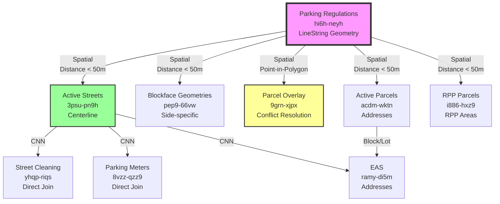

# Complete Spatial Join Matrix: Parking Regulations with All Datasets

**Date**: November 28, 2024  
**Purpose**: Comprehensive analysis of how Parking Regulations join with every dataset in the architecture

---

## Overview

**Parking Regulations (hi6h-neyh)** have:
- ❌ NO CNN identifiers
- ❌ NO Block/Lot identifiers  
- ❌ NO direct foreign keys
- ✅ LineString geometry (spatial data)
- ✅ Neighborhood and district fields (for conflict resolution)

**Therefore**: ALL joins must be **spatial** or **attribute-based** (neighborhood/district matching)

---

## Complete Join Matrix

### 1. Parking Regulations → Active Streets (3psu-pn9h)

**Join Type**: Spatial (geometry-based)

**Method**:
```python
# Find Active Streets centerlines near regulation geometry
regulation_geo = regulation["geometry"]  # LineString

nearby_streets = db.active_streets.find({
    "line": {
        "$near": {
            "$geometry": regulation_geo,
            "$maxDistance": 50  # meters
        }
    }
})

# For each nearby street:
# - Check distance to centerline
# - Determine if regulation applies to CNN L, CNN R, or both
```

**Join Keys**:
- Spatial: `regulation.geometry` ↔ `active_streets.line` (centerline)
- Distance threshold: < 50 meters

**Result**: CNN identifier(s) that the regulation applies to

**Coverage**: ~95%+ (most regulations can be matched to streets)

---

### 2. Parking Regulations → pep9-66vw (Blockface Geometries)

**Join Type**: Spatial (geometry-based)

**Method**:
```python
# Find blockface geometries near regulation geometry
regulation_geo = regulation["geometry"]

nearby_blockfaces = db.blockfaces.find({
    "shape": {
        "$near": {
            "$geometry": regulation_geo,
            "$maxDistance": 50
        }
    }
})

# For each blockface:
# - Check which side (L or R) based on geometry
# - More precise than centerline matching
```

**Join Keys**:
- Spatial: `regulation.geometry` ↔ `blockface.shape`
- Distance threshold: < 50 meters

**Result**: Blockface GlobalID and side (L or R)

**Coverage**: ~50-60% (only where blockface geometries exist)

**Note**: This is an **enhancement** to Active Streets join, not a replacement

---

### 3. Parking Regulations → Street Cleaning (yhqp-riqs)

**Join Type**: Indirect (via CNN from Active Streets)

**Method**:
```python
# Step 1: Join regulation to Active Streets (spatial)
cnn = spatial_join_to_active_streets(regulation)

# Step 2: Join to street cleaning via CNN + Side
street_cleaning = db.street_cleaning.find({
    "cnn": cnn,
    "cnnrightleft": side  # L or R
})

# Result: Both regulation and cleaning rules for same location
```

**Join Keys**:
- Indirect: regulation → CNN (spatial) → street_cleaning (direct)
- Direct keys: `cnn` + `cnnrightleft`

**Purpose**: Combine parking regulations with street cleaning schedules

**Coverage**: 100% once CNN is determined

---

### 4. Parking Regulations → Parcel Overlay (9grn-xjpx)

**Join Type**: Spatial (point-in-polygon) + Attribute matching

**Method**:
```python
# Get regulation's midpoint
reg_shape = shape(regulation["geometry"])
reg_midpoint = reg_shape.interpolate(0.5, normalized=True)

# Find parcel containing this point
parcel = db.parcel_overlay.find_one({
    "geometry": {
        "$geoIntersects": {
            "$geometry": {
                "type": "Point",
                "coordinates": [reg_midpoint.x, reg_midpoint.y]
            }
        }
    }
})

# Match attributes for validation
if (parcel["analysis_neighborhood"] == regulation["analysis_neighborhood"] and
    parcel["supervisor_district"] == regulation["supervisor_district"]):
    # Confirmed match
```

**Join Keys**:
- Spatial: `regulation.geometry` (midpoint) ↔ `parcel.geometry` (polygon)
- Attribute: `analysis_neighborhood` + `supervisor_district`

**Purpose**: Conflict resolution for boundary cases

**Coverage**: ~100% (all regulations have neighborhood/district)

---

### 5. Parking Regulations → Active Parcels (acdm-wktn)

**Join Type**: Spatial (line-to-polygon proximity)

**Method**:
```python
# Find parcels near regulation geometry
regulation_geo = regulation["geometry"]

nearby_parcels = db.active_parcels.find({
    "shape": {
        "$near": {
            "$geometry": regulation_geo,
            "$maxDistance": 50
        }
    }
})

# Get parcel addresses and block/lot numbers
for parcel in nearby_parcels:
    addresses = f"{parcel['from_address_num']}-{parcel['to_address_num']} {parcel['street_name']}"
    block_lot = parcel["mapblklot"]
```

**Join Keys**:
- Spatial: `regulation.geometry` ↔ `parcel.shape`
- Distance threshold: < 50 meters

**Purpose**: Link regulations to specific addresses and block/lot numbers

**Coverage**: ~90%+ (most regulations near parcels)

---

### 6. Parking Regulations → EAS (Enterprise Addressing System) (ramy-di5m)

**Join Type**: Indirect (via Active Parcels or Active Streets)

**Method**:
```python
# Option A: Via Active Parcels
parcel = spatial_join_to_active_parcels(regulation)
addresses = eas.find({"mapblklot": parcel["mapblklot"]})

# Option B: Via Active Streets
cnn = spatial_join_to_active_streets(regulation)
addresses = eas.find({"cnn": cnn})

# Result: Specific addresses where regulation applies
```

**Join Keys**:
- Indirect via: Block/Lot OR CNN
- EAS has both `mapblklot` and `cnn` fields

**Purpose**: Get specific street addresses for regulations

**Coverage**: High (EAS is comprehensive)

---

### 7. Parking Regulations → RPP Parcels (i886-hxz9)

**Join Type**: Spatial (line-to-polygon proximity) + Attribute matching

**Method**:
```python
# Find RPP parcels near regulation
regulation_geo = regulation["geometry"]

nearby_rpp = db.rpp_parcels.find({
    "shape": {
        "$near": {
            "$geometry": regulation_geo,
            "$maxDistance": 50
        }
    }
})

# Match RPP area from regulation to parcel
reg_rpp_area = regulation.get("rpparea1") or regulation.get("rpparea2")

for parcel in nearby_rpp:
    if parcel["rppeligib"] == reg_rpp_area:
        # Confirmed RPP match
```

**Join Keys**:
- Spatial: `regulation.geometry` ↔ `rpp_parcel.shape`
- Attribute: `rpparea1/rpparea2` ↔ `rppeligib`

**Purpose**: Validate RPP area assignments

**Coverage**: ~30-40% (only regulations with RPP areas)

---

### 8. Parking Regulations → Parking Meters (8vzz-qzz9)

**Join Type**: Indirect (via CNN from Active Streets)

**Method**:
```python
# Step 1: Join regulation to Active Streets
cnn = spatial_join_to_active_streets(regulation)

# Step 2: Find meters on that CNN
meters = db.parking_meters.find({
    "street_seg_ctrln_id": cnn
})

# Result: Meters and regulations for same street segment
```

**Join Keys**:
- Indirect: regulation → CNN (spatial) → meters (direct)
- Direct key: `street_seg_ctrln_id` (CNN)

**Purpose**: Combine meter data with parking regulations

**Coverage**: ~20-30% (only metered streets)

---

## Visual Join Diagram



---

## Join Strategy Summary

### Primary Spatial Joins (Direct)

| Target Dataset | Join Method | Key Fields | Coverage | Purpose |
|----------------|-------------|------------|----------|---------|
| **Active Streets** | Spatial proximity | geometry ↔ line | 95%+ | Get CNN |
| **Blockface Geometries** | Spatial proximity | geometry ↔ shape | 50-60% | Get side (L/R) |
| **Parcel Overlay** | Point-in-polygon | geometry ↔ geometry | 100% | Conflict resolution |
| **Active Parcels** | Spatial proximity | geometry ↔ shape | 90%+ | Get addresses |
| **RPP Parcels** | Spatial proximity | geometry ↔ shape | 30-40% | Validate RPP |

### Secondary Joins (Indirect via CNN)

| Target Dataset | Join Path | Key Fields | Coverage | Purpose |
|----------------|-----------|------------|----------|---------|
| **Street Cleaning** | PR → AS → SC | CNN + Side | 100% | Combine rules |
| **Parking Meters** | PR → AS → PM | CNN | 20-30% | Combine rules |
| **EAS** | PR → AS → EAS | CNN | High | Get addresses |

---

## Implementation Pattern

### Complete Join Workflow

```python
async def enrich_parking_regulation(regulation):
    """
    Complete workflow to join parking regulation with all datasets.
    """
    
    reg_geo = regulation["geometry"]
    results = {}
    
    # 1. PRIMARY: Join to Active Streets (get CNN)
    cnn_segments = await spatial_join_to_active_streets(reg_geo)
    results["cnn_segments"] = cnn_segments
    
    # 2. ENHANCEMENT: Join to Blockface Geometries (if available)
    blockfaces = await spatial_join_to_blockfaces(reg_geo)
    results["blockfaces"] = blockfaces
    
    # 3. VALIDATION: Join to Parcel Overlay (for boundaries)
    if is_boundary_case(cnn_segments, reg_geo):
        parcel = await point_in_polygon_join(reg_geo, "parcel_overlay")
        results["parcel"] = parcel
        
        # Validate neighborhood + district match
        if not validate_neighborhood_district(regulation, parcel):
            logger.warning("Neighborhood/district mismatch")
    
    # 4. ADDRESSES: Join to Active Parcels
    parcels = await spatial_join_to_active_parcels(reg_geo)
    results["parcels"] = parcels
    results["addresses"] = extract_addresses(parcels)
    
    # 5. RPP: Join to RPP Parcels (if regulation has RPP area)
    if regulation.get("rpparea1") or regulation.get("rpparea2"):
        rpp_parcels = await spatial_join_to_rpp_parcels(reg_geo)
        results["rpp_parcels"] = rpp_parcels
    
    # 6. INDIRECT: Get related data via CNN
    for cnn_segment in cnn_segments:
        cnn = cnn_segment["cnn"]
        side = cnn_segment["side"]
        
        # Street cleaning
        cleaning = await db.street_cleaning.find({
            "cnn": cnn,
            "cnnrightleft": side
        }).to_list()
        results["street_cleaning"] = cleaning
        
        # Parking meters
        meters = await db.parking_meters.find({
            "street_seg_ctrln_id": cnn
        }).to_list()
        results["meters"] = meters
        
        # EAS addresses
        eas_addresses = await db.eas.find({
            "cnn": cnn
        }).to_list()
        results["eas_addresses"] = eas_addresses
    
    return results
```

---

## Performance Considerations

### Indexing Requirements

```javascript
// Parking Regulations
db.parking_regulations.createIndex({ "geometry": "2dsphere" })
db.parking_regulations.createIndex({ "analysis_neighborhood": 1, "supervisor_district": 1 })

// Active Streets
db.active_streets.createIndex({ "line": "2dsphere" })
db.active_streets.createIndex({ "cnn": 1 })

// Blockface Geometries
db.blockfaces.createIndex({ "shape": "2dsphere" })
db.blockfaces.createIndex({ "globalid": 1 })

// Parcel Overlay
db.parcel_overlay.createIndex({ "geometry": "2dsphere" })
db.parcel_overlay.createIndex({ "analysis_neighborhood": 1, "supervisor_district": 1 })

// Active Parcels
db.active_parcels.createIndex({ "shape": "2dsphere" })
db.active_parcels.createIndex({ "mapblklot": 1 })

// RPP Parcels
db.rpp_parcels.createIndex({ "shape": "2dsphere" })
db.rpp_parcels.createIndex({ "rppeligib": 1 })

// Street Cleaning
db.street_cleaning.createIndex({ "cnn": 1, "cnnrightleft": 1 })

// Parking Meters
db.parking_meters.createIndex({ "street_seg_ctrln_id": 1 })

// EAS
db.eas.createIndex({ "cnn": 1 })
db.eas.createIndex({ "mapblklot": 1 })
```

### Query Optimization

```python
# Batch spatial queries
regulations_batch = regulations[0:100]

# Parallel processing
tasks = [
    enrich_parking_regulation(reg)
    for reg in regulations_batch
]

results = await asyncio.gather(*tasks)
```

---

## Coverage Analysis

### Expected Join Success Rates

| Join Target | Expected Coverage | Notes |
|-------------|------------------|-------|
| Active Streets | 95%+ | Primary join, high success |
| Blockface Geometries | 50-60% | Optional enhancement |
| Parcel Overlay | 100% | Always available for boundaries |
| Active Parcels | 90%+ | Most regulations near parcels |
| RPP Parcels | 30-40% | Only for RPP regulations |
| Street Cleaning | 100% | Via CNN (once determined) |
| Parking Meters | 20-30% | Only metered streets |
| EAS | High | Via CNN or Block/Lot |

---

## Conclusion

**Parking Regulations join with ALL datasets through**:

1. ✅ **Primary Spatial Joins** - Direct geometry-based matching
   - Active Streets (CNN)
   - Blockface Geometries (side-specific)
   - Parcel Overlay (conflict resolution)
   - Active Parcels (addresses)
   - RPP Parcels (RPP validation)

2. ✅ **Secondary Indirect Joins** - Via CNN from Active Streets
   - Street Cleaning
   - Parking Meters
   - EAS

3. ✅ **Attribute Matching** - Neighborhood + District validation
   - Parcel Overlay (boundary resolution)
   - RPP Parcels (RPP area matching)

**Key Insight**: The CNN from Active Streets acts as the **central hub** that enables indirect joins to all other CNN-based datasets.

---

**Last Updated**: November 28, 2024  
**Status**: Complete Spatial Join Analysis