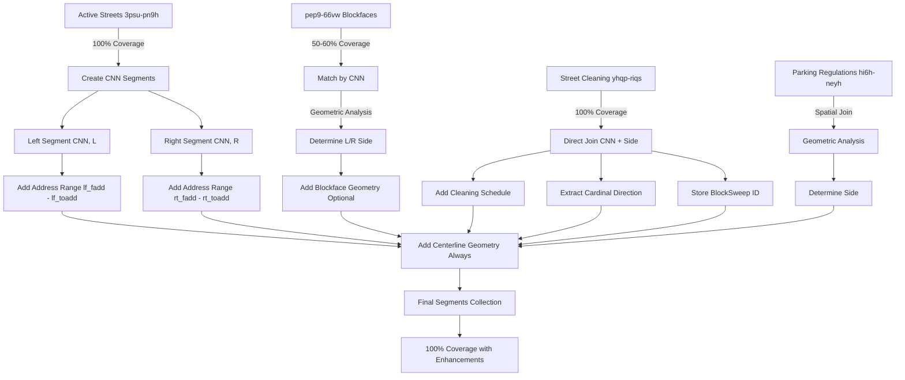

# Active Streets Data Ingestion Pipeline - Architecture Summary

**Date**: November 28, 2024  
**Status**: Architecture Complete, Ready for Implementation

---

## Executive Summary

This document summarizes the complete re-architecture of the Active Streets data ingestion pipeline, incorporating findings from comprehensive dataset investigations. The new architecture creates a robust, efficient system for linking CNNs with address ranges and parking regulations.

---

## Key Architectural Decisions

### 1. Active Streets (3psu-pn9h) as the Backbone ✅

**Decision**: Use Active Streets as the primary data source for all street segments.

**Rationale**:
- 100% coverage of all street segments
- Authoritative CNN identifiers
- Complete address range data (>95% populated)
- Always-available centerline geometries

**Implementation**: Create two segments per CNN (Left and Right sides)

### 2. Address Ranges for Deterministic Lookups ✅

**Decision**: Store address ranges (fromAddress, toAddress) for each segment side.

**Benefits**:
- Deterministic address-to-segment matching
- User-friendly display ("3401-3449 17th St")
- Enables address-based RPP matching
- No spatial analysis required for address queries

**Data Source**: Active Streets fields `lf_fadd`, `lf_toadd`, `rt_fadd`, `rt_toadd`

### 3. pep9-66vw as Optional Enhancement ✅

**Decision**: Treat blockface geometries as optional enhancements, not requirements.

**Key Finding**: 
- Only ~50-60% of CNNs have blockface geometries
- Each CNN with blockface data has TWO GlobalIDs (left and right sides)
- GlobalID is unique and can serve as primary key
- Geometries are parallel offsets from centerline

**Implementation**:
- Primary geometry: Centerline (always available)
- Enhancement: Blockface geometry (when available)
- Store GlobalID for future reference

### 4. Street Cleaning Direct Join ✅

**Decision**: Join street cleaning data directly via CNN + Side (no geometric analysis needed).

**Key Finding**:
- 100% of street cleaning records have CNN and Side fields
- Direct join: `sweeping.cnn = segment.cnn AND sweeping.cnnrightleft = segment.side`
- No spatial queries required

**Additional Data to Preserve**:
- **BlockSweep ID**: For future joins and route tracking
- **Cardinal Direction** (blockside): N, S, E, W, NE, NW, SE, SW (98% coverage)
- **Sweeping Geometry**: LineString of cleaning route

---

## Data Model

### StreetSegment (Final Architecture)

```typescript
interface StreetSegment {
  // Primary Identity
  cnn: string;                          // From Active Streets (e.g., "1046000")
  side: "L" | "R";                      // Left or Right side
  
  // Optional Enhancement
  globalid?: string;                    // From pep9-66vw (GUID format)
  
  // Street Information
  streetName: string;                   // e.g., "17TH ST"
  fromStreet: string;                   // Intersection start
  toStreet: string;                     // Intersection end
  
  // Address Ranges (NEW - from Active Streets)
  fromAddress?: string;                 // Starting address (e.g., "3401")
  toAddress?: string;                   // Ending address (e.g., "3449")
  
  // Geometries
  centerlineGeometry: LineString;       // ALWAYS present (from Active Streets)
  blockfaceGeometry?: LineString;       // OPTIONAL (from pep9-66vw, ~50-60% coverage)
  
  // Cardinal Direction (NEW - from street cleaning)
  cardinalDirection?: string;           // N, S, E, W, NE, NW, SE, SW (98% coverage)
  
  // Parking Rules
  parkingRegulations: ParkingRegulation[];
  streetCleaning: StreetCleaningSchedule[];
  meters: ParkingMeter[];
  
  // Street Cleaning Metadata (NEW)
  sweepingBlocksweepId?: string;        // For future joins
  sweepingGeometry?: LineString;        // Cleaning route path
  
  // Metadata
  zipCode?: string;
  layer?: string;
}
```

---

## Data Flow Architecture



---

## Coverage Analysis

### Data Availability by Source

| Data Element | Source | Coverage | Notes |
|--------------|--------|----------|-------|
| **CNN** | Active Streets | 100% | Primary identifier |
| **Centerline Geometry** | Active Streets | 100% | Always available |
| **Address Ranges** | Active Streets | >95% | lf_fadd, lf_toadd, rt_fadd, rt_toadd |
| **Blockface Geometry** | pep9-66vw | 50-60% | Optional enhancement |
| **GlobalID** | pep9-66vw | 50-60% | When blockface available |
| **Street Cleaning** | yhqp-riqs | 100% | Direct CNN + Side join |
| **Cardinal Direction** | yhqp-riqs | 98% | From blockside field |
| **BlockSweep ID** | yhqp-riqs | 100% | For future joins |

### Final Segment Coverage

- **Total Segments**: ~4,000 (2 per CNN × ~2,000 CNNs in target area)
- **With Centerline**: 100%
- **With Address Ranges**: >95%
- **With Blockface Geometry**: 50-60%
- **With Cardinal Direction**: 98%
- **With Street Cleaning**: ~80% (where applicable)

---

## Join Strategies by Dataset

### 1. Active Streets → Segments (Primary)
```python
# Create two segments per CNN
for cnn_record in active_streets:
    left_segment = {
        "cnn": cnn_record.cnn,
        "side": "L",
        "fromAddress": cnn_record.lf_fadd,
        "toAddress": cnn_record.lf_toadd,
        "centerlineGeometry": cnn_record.line
    }
    
    right_segment = {
        "cnn": cnn_record.cnn,
        "side": "R",
        "fromAddress": cnn_record.rt_fadd,
        "toAddress": cnn_record.rt_toadd,
        "centerlineGeometry": cnn_record.line
    }
```

### 2. pep9-66vw → Segments (Optional Enhancement)
```python
# Match blockface geometries by CNN
for blockface in pep9_records:
    if blockface.cnn_id:
        # Get both segments for this CNN
        segments = find_segments(cnn=blockface.cnn_id)
        
        # Determine which side using geometric analysis
        side = determine_side(centerline, blockface.shape)
        
        # Add to appropriate segment
        segment = segments[side]
        segment.blockfaceGeometry = blockface.shape
        segment.globalid = blockface.globalid
```

### 3. Street Cleaning → Segments (Direct Join)
```python
# Direct join - no geometric analysis needed
for sweeping in street_cleaning:
    segment = find_segment(
        cnn=sweeping.cnn,
        side=sweeping.cnnrightleft  # 'L' or 'R'
    )
    
    segment.streetCleaning.append({
        "day": sweeping.weekday,
        "fromHour": sweeping.fromhour,
        "toHour": sweeping.tohour
    })
    
    # Preserve additional data
    segment.cardinalDirection = sweeping.blockside
    segment.sweepingBlocksweepId = sweeping.blocksweepid
    segment.sweepingGeometry = sweeping.line
```

### 4. Parking Regulations → Segments (Spatial Join)
```python
# Requires geometric analysis
for regulation in parking_regulations:
    # Find nearby segments
    nearby_segments = find_segments_near(regulation.geometry)
    
    # Determine which side
    for segment in nearby_segments:
        side = determine_side(
            segment.centerlineGeometry,
            regulation.geometry
        )
        
        if side == segment.side:
            segment.parkingRegulations.append(regulation)
```

---

## Query Patterns

### 1. Address-Based Query (Preferred)
```python
# Fast, deterministic lookup
def find_segment_by_address(street_name: str, address: int):
    return db.segments.find_one({
        "streetName": street_name,
        "fromAddress": {"$lte": str(address)},
        "toAddress": {"$gte": str(address)}
    })

# Example: "What are the rules at 3425 17th St?"
segment = find_segment_by_address("17TH ST", 3425)
# Returns: Left side segment with all rules
```

### 2. Geospatial Query (Fallback)
```python
# When user provides location, not address
def find_segments_near(lat: float, lng: float, radius: int = 50):
    return db.segments.find({
        "centerlineGeometry": {
            "$near": {
                "$geometry": {"type": "Point", "coordinates": [lng, lat]},
                "$maxDistance": radius
            }
        }
    })

# Example: "What are the rules at my current location?"
segments = find_segments_near(37.7526, -122.4107, 50)
```

### 3. CNN + Side Query (Direct)
```python
# When you know the CNN and side
def find_segment(cnn: str, side: str):
    return db.segments.find_one({
        "cnn": cnn,
        "side": side
    })

# Example: From street cleaning data
segment = find_segment("1046000", "L")
```

---

## Implementation Phases

### Phase 1: Data Model Updates ✅
- [x] Add `fromAddress` and `toAddress` fields
- [x] Make `blockfaceGeometry` optional
- [x] Add `globalid` field
- [ ] Add `cardinalDirection` field
- [ ] Add `sweepingBlocksweepId` field
- [ ] Add `sweepingGeometry` field

### Phase 2: Ingestion Pipeline ✅
- [x] Create two segments per CNN
- [x] Populate address ranges from Active Streets
- [x] Add centerline geometry (always)
- [ ] Match and add blockface geometries (optional)
- [ ] Implement direct CNN + Side join for street cleaning
- [ ] Extract and store cardinal directions
- [ ] Preserve BlockSweep IDs and geometries

### Phase 3: Database Population
- [ ] Run updated ingestion pipeline
- [ ] Verify segment count (~4,000 expected)
- [ ] Validate address range coverage (>95%)
- [ ] Check cardinal direction coverage (98%)
- [ ] Confirm street cleaning joins (100%)

### Phase 4: API Enhancements
- [ ] Add address range fields to responses
- [ ] Include cardinal direction in segment data
- [ ] Implement address-based search endpoint
- [ ] Support filtering by cardinal direction
- [ ] Return BlockSweep IDs in cleaning schedules

### Phase 5: Frontend Integration
- [ ] Display address ranges ("3401-3449 17th St")
- [ ] Show cardinal directions ("North side of Market St")
- [ ] Implement address-based search
- [ ] Add address validation
- [ ] Visualize blockface geometries when available

---

## Key Benefits

### 1. Complete Coverage
- ✅ 100% of streets represented (via Active Streets)
- ✅ No gaps from missing blockface geometries
- ✅ All segments can display and function

### 2. Deterministic Lookups
- ✅ Address-based queries are precise
- ✅ No ambiguity in side determination
- ✅ Fast, indexed queries

### 3. User-Friendly Display
- ✅ Show address ranges to users
- ✅ Display cardinal directions (N, S, E, W)
- ✅ Clear side indicators (Left/Right)

### 4. Efficient Joins
- ✅ Direct CNN + Side join for street cleaning (no spatial analysis)
- ✅ Address-based RPP matching (no spatial queries)
- ✅ Optional blockface enhancement (when available)

### 5. Future-Proof
- ✅ BlockSweep IDs preserved for future joins
- ✅ GlobalIDs stored for blockface reference
- ✅ Geometries preserved for spatial operations
- ✅ Extensible data model

---

## Technical Specifications

### Database Indexes Required

```javascript
// Primary lookup
db.segments.createIndex({ "cnn": 1, "side": 1 }, { unique: true })

// Address-based search
db.segments.createIndex({ "streetName": 1, "fromAddress": 1, "toAddress": 1 })

// Geospatial queries
db.segments.createIndex({ "centerlineGeometry": "2dsphere" })

// GlobalID lookup (when available)
db.segments.createIndex({ "globalid": 1 }, { sparse: true })

// Cardinal direction filtering
db.segments.createIndex({ "cardinalDirection": 1 })
```

### Data Validation Rules

```python
# Every segment must have:
assert segment.cnn is not None
assert segment.side in ["L", "R"]
assert segment.centerlineGeometry is not None
assert segment.streetName is not None

# Most segments should have:
assert segment.fromAddress is not None  # >95%
assert segment.toAddress is not None    # >95%

# Some segments will have:
# - blockfaceGeometry (~50-60%)
# - globalid (~50-60%)
# - cardinalDirection (~98%)
```

---

## Success Metrics

### Data Quality
- [ ] 100% of CNNs have two segments (L and R)
- [ ] >95% of segments have address ranges
- [ ] 98% of segments have cardinal directions
- [ ] 50-60% of segments have blockface geometries
- [ ] 100% of applicable segments have street cleaning data

### Performance
- [ ] Address-based queries < 50ms
- [ ] Geospatial queries < 100ms
- [ ] CNN + Side queries < 10ms

### User Experience
- [ ] All streets visible on map
- [ ] Address ranges displayed correctly
- [ ] Cardinal directions shown accurately
- [ ] No "data not available" gaps

---

## References

### Documentation
- [`CNN_ADDRESS_RANGE_ARCHITECTURE.md`](backend/CNN_ADDRESS_RANGE_ARCHITECTURE.md) - Address range implementation
- [`DATA_ARCHITECTURE_UPDATED.md`](backend/DATA_ARCHITECTURE_UPDATED.md) - Complete architecture overview
- [`STREET_CLEANING_JOIN_CONFIRMED.md`](backend/STREET_CLEANING_JOIN_CONFIRMED.md) - Street cleaning analysis
- [`ADDRESS_RANGE_IMPLEMENTATION.md`](backend/ADDRESS_RANGE_IMPLEMENTATION.md) - Implementation guide

### Investigation Results
- [`active_streets_inspection.txt`](backend/active_streets_inspection.txt) - Active Streets dataset structure
- [`pep9_globalid_shape_analysis.txt`](backend/pep9_globalid_shape_analysis.txt) - Blockface geometry analysis
- [`pep9_cnn_investigation.txt`](backend/pep9_cnn_investigation.txt) - CNN coverage analysis
- [`street_cleaning_join_analysis.txt`](backend/street_cleaning_join_analysis.txt) - Street cleaning join analysis

### Code
- [`models.py`](backend/models.py) - Data model definitions
- [`ingest_data_cnn_segments.py`](backend/ingest_data_cnn_segments.py) - CNN-based ingestion
- [`ingest_data.py`](backend/ingest_data.py) - Legacy ingestion (for reference)

---

**Last Updated**: November 28, 2024  
**Status**: Architecture Complete, Ready for Implementation  
**Next Step**: Update data model with cardinal direction fields, then run ingestion