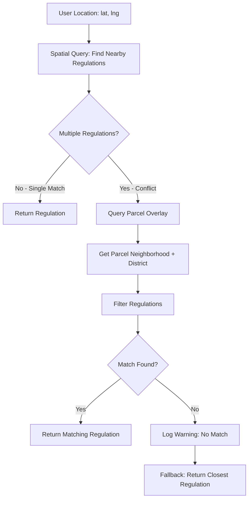

# Parcel Overlay Conflict Resolution Strategy

**Date**: November 28, 2024  
**Purpose**: Resolve spatial ambiguity in parking regulation assignments

---

## Problem Statement

When spatial joins create ambiguity about which parking regulation applies to a specific location, we need a deterministic way to resolve conflicts.

**Example Scenario**:
```
User Location: [37.7526, -122.4107]
    ↓
Spatial Query finds 3 nearby parking regulations:
    1. Regulation A (Mission neighborhood, District 9)
    2. Regulation B (Mission neighborhood, District 9)  
    3. Regulation C (SOMA neighborhood, District 6)
    
Which one applies?
```

---

## Solution: Parcel Overlay as Tie-Breaker

### Dataset: Parcel Overlay (9grn-xjpx)

**Purpose**: Provides authoritative neighborhood and supervisor district assignments at the parcel level with NO OVERLAP.

**Key Fields**:
- `mapblklot`: Block/Lot identifier (links to parcels)
- `analysis_neighborhood`: Neighborhood name (e.g., "Mission", "SOMA")
- `supervisor_district`: Supervisor district number (e.g., "9", "6")
- `geometry`: Parcel boundary (MultiPolygon)

**Critical Property**: Each parcel belongs to exactly ONE neighborhood and ONE supervisor district - no ambiguity.

---

## Conflict Resolution Algorithm

### Step 1: Identify Conflict

```python
# Spatial query returns multiple regulations
regulations = find_nearby_regulations(lat, lng, radius=50)

if len(regulations) > 1:
    # CONFLICT: Multiple regulations found
    # Need to determine which one applies
    pass
```

### Step 2: Get Parcel Context

```python
# Find which parcel the user location is in
parcel = parcel_overlay.find_one({
    "geometry": {
        "$geoIntersects": {
            "$geometry": {
                "type": "Point",
                "coordinates": [lng, lat]
            }
        }
    }
})

# Extract authoritative neighborhood and district
parcel_neighborhood = parcel["analysis_neighborhood"]  # e.g., "Mission"
parcel_district = parcel["supervisor_district"]        # e.g., "9"
```

### Step 3: Match Regulation to Parcel

```python
# Filter regulations to match parcel's neighborhood and district
matching_regulation = None

for regulation in regulations:
    reg_neighborhood = regulation.get("analysis_neighborhood")
    reg_district = regulation.get("supervisor_district")
    
    # MATCH: Both neighborhood AND district must match
    if (reg_neighborhood == parcel_neighborhood and 
        reg_district == parcel_district):
        matching_regulation = regulation
        break

# Return the regulation that matches the parcel's context
return matching_regulation
```

---

## Complete Workflow



---

## Implementation Example

### Python Implementation

```python
async def resolve_parking_regulation_conflict(
    lat: float,
    lng: float,
    regulations: List[Dict]
) -> Dict:
    """
    Resolve conflicts when multiple parking regulations are found.
    
    Uses Parcel Overlay to determine authoritative neighborhood and
    supervisor district, then matches to the correct regulation.
    """
    
    # Step 1: Check if there's actually a conflict
    if len(regulations) <= 1:
        return regulations[0] if regulations else None
    
    # Step 2: Find the parcel at this location
    parcel = await db.parcel_overlay.find_one({
        "geometry": {
            "$geoIntersects": {
                "$geometry": {
                    "type": "Point",
                    "coordinates": [lng, lat]
                }
            }
        }
    })
    
    if not parcel:
        # Fallback: No parcel found, return closest regulation
        logger.warning(f"No parcel found at {lat}, {lng}")
        return regulations[0]
    
    # Step 3: Extract parcel's neighborhood and district
    parcel_neighborhood = parcel.get("analysis_neighborhood")
    parcel_district = parcel.get("supervisor_district")
    
    # Step 4: Find regulation matching parcel's context
    for regulation in regulations:
        reg_neighborhood = regulation.get("analysis_neighborhood")
        reg_district = regulation.get("supervisor_district")
        
        # Match on BOTH neighborhood AND district
        if (reg_neighborhood == parcel_neighborhood and
            reg_district == parcel_district):
            logger.info(
                f"Resolved conflict: Matched regulation to "
                f"{parcel_neighborhood}, District {parcel_district}"
            )
            return regulation
    
    # Step 5: No match found - log and return closest
    logger.warning(
        f"No regulation matches parcel context: "
        f"{parcel_neighborhood}, District {parcel_district}"
    )
    return regulations[0]  # Fallback to closest
```

### API Integration

```python
@app.get("/api/v1/blockfaces")
async def get_blockfaces(lat: float, lng: float, radius_meters: int = 50):
    """
    Get parking regulations at a location with conflict resolution.
    """
    
    # Find nearby regulations
    regulations = await find_nearby_regulations(lat, lng, radius_meters)
    
    # Resolve conflicts if multiple regulations found
    if len(regulations) > 1:
        resolved_regulation = await resolve_parking_regulation_conflict(
            lat, lng, regulations
        )
        return {"regulation": resolved_regulation, "conflict_resolved": True}
    
    return {"regulation": regulations[0] if regulations else None}
```

---

## Data Requirements

### Parcel Overlay Fields Needed

```python
{
    "mapblklot": "1222047",              # Block/Lot identifier
    "analysis_neighborhood": "Mission",   # Neighborhood name
    "supervisor_district": "9",          # District number
    "geometry": {                        # Parcel boundary
        "type": "MultiPolygon",
        "coordinates": [...]
    }
}
```

### Parking Regulation Fields Needed

```python
{
    "objectid": "12345",
    "regulation": "2 HR PARKING 9AM-6PM",
    "analysis_neighborhood": "Mission",   # Must match parcel
    "supervisor_district": "9",          # Must match parcel
    "geometry": {
        "type": "LineString",
        "coordinates": [...]
    }
}
```

---

## Edge Cases

### Case 1: No Parcel Found
```python
# User location is in a street, park, or other non-parcel area
# Fallback: Return closest regulation by distance
```

### Case 2: No Matching Regulation
```python
# Parcel is in Mission/District 9, but no regulations match
# Possible reasons:
#   - Regulation data incomplete
#   - Neighborhood/district mismatch in data
# Fallback: Return closest regulation with warning log
```

### Case 3: Parcel Spans Multiple Regulations
```python
# Large parcel (e.g., park) might have multiple regulations
# Solution: Match on neighborhood + district still works
# The parcel has ONE neighborhood/district assignment
```

### Case 4: Regulation Missing Neighborhood/District
```python
# Some regulations might not have these fields populated
# Solution: Skip these in matching, fall back to spatial proximity
```

---

## Performance Considerations

### Indexing Strategy

```javascript
// Parcel Overlay indexes
db.parcel_overlay.createIndex({ "geometry": "2dsphere" })
db.parcel_overlay.createIndex({ "mapblklot": 1 })
db.parcel_overlay.createIndex({ 
    "analysis_neighborhood": 1, 
    "supervisor_district": 1 
})

// Parking Regulations indexes
db.parking_regulations.createIndex({ "geometry": "2dsphere" })
db.parking_regulations.createIndex({ 
    "analysis_neighborhood": 1, 
    "supervisor_district": 1 
})
```

### Query Optimization

```python
# Cache parcel lookups for repeated queries in same area
# Most users will query same location multiple times

from functools import lru_cache

@lru_cache(maxsize=1000)
async def get_parcel_context(lat: float, lng: float):
    """Cached parcel lookup"""
    # Round coordinates to reduce cache misses
    lat_rounded = round(lat, 5)
    lng_rounded = round(lng, 5)
    
    return await db.parcel_overlay.find_one({
        "geometry": {
            "$geoIntersects": {
                "$geometry": {
                    "type": "Point",
                    "coordinates": [lng_rounded, lat_rounded]
                }
            }
        }
    })
```

---

## Testing Strategy

### Test Case 1: Clear Match
```python
# Location in Mission, District 9
# Multiple regulations found
# One regulation matches Mission + District 9
# Expected: Return matching regulation
```

### Test Case 2: Boundary Case
```python
# Location on border between Mission and SOMA
# Parcel Overlay determines: Mission, District 9
# Expected: Return Mission regulation, not SOMA
```

### Test Case 3: No Conflict
```python
# Location with single regulation
# Expected: Skip conflict resolution, return directly
```

### Test Case 4: No Parcel
```python
# Location in middle of street (no parcel)
# Expected: Fallback to closest regulation
```

---

## Benefits

### 1. Deterministic Resolution
- No ambiguity: Parcel Overlay provides ONE answer
- Consistent results for same location
- Authoritative source (city-maintained boundaries)

### 2. Accurate Assignments
- Respects official neighborhood boundaries
- Aligns with supervisor district boundaries
- Matches how city organizes parking data

### 3. Performance
- Single additional query (parcel lookup)
- Can be cached for repeated queries
- Indexed for fast spatial lookups

### 4. Maintainability
- Clear logic: Match neighborhood + district
- Easy to debug: Log which parcel was found
- Fallback strategy for edge cases

---

## Integration with CNN Architecture

The Parcel Overlay conflict resolution **complements** the CNN-based architecture:

```
Primary Flow (No Conflict):
  User Location → CNN Segment → Parking Regulation
  
Conflict Resolution Flow:
  User Location → Multiple Regulations → Parcel Overlay → Match → Correct Regulation
```

**Key Point**: Parcel Overlay is used ONLY when spatial queries create ambiguity. The CNN-based architecture remains the primary system.

---

## Implementation Checklist

- [ ] Ingest Parcel Overlay dataset (9grn-xjpx)
- [ ] Create 2dsphere index on parcel geometry
- [ ] Create compound index on neighborhood + district
- [ ] Implement `resolve_parking_regulation_conflict()` function
- [ ] Add conflict resolution to blockface API endpoint
- [ ] Add logging for conflict resolution events
- [ ] Implement caching for parcel lookups
- [ ] Write unit tests for edge cases
- [ ] Document conflict resolution in API docs
- [ ] Monitor conflict resolution rate in production

---

## References

- **Parcel Overlay Dataset**: [9grn-xjpx](https://data.sfgov.org/d/9grn-xjpx)
- **Parking Regulations**: [hi6h-neyh](https://data.sfgov.org/d/hi6h-neyh)
- **Block/Lot Investigation**: [`block_lot_investigation.txt`](backend/block_lot_investigation.txt:1)

---

**Last Updated**: November 28, 2024  
**Status**: Strategy Defined, Ready for Implementation