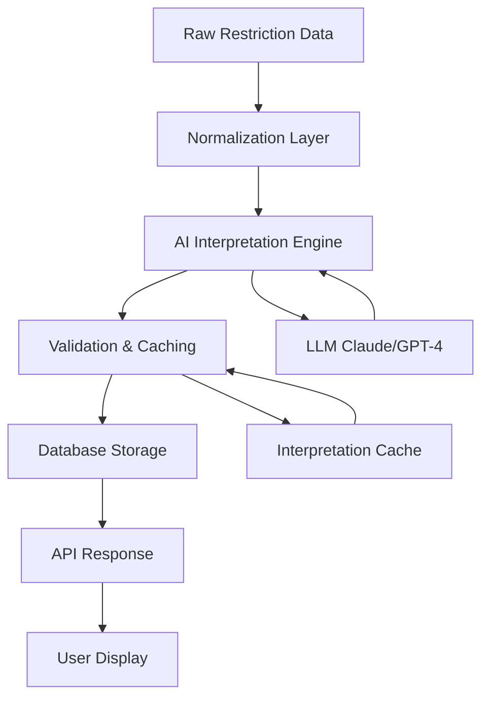

# AI-Powered Restriction Interpretation System

## Executive Summary

This document outlines an AI-powered system to systematically interpret, clarify, and normalize parking restrictions using Large Language Models (LLMs). The system addresses ambiguous restriction text like "Oversized vehicles and trailers are those longer than 22 feet or taller than 7 feet" by converting it to clear, actionable messages like "No oversized vehicles (over 22 feet long or 7 feet tall)".

## Problem Statement

### Current Issues

1. **Ambiguous Restrictions**: Text like "Oversized vehicles and trailers are those longer than 22 feet" doesn't clearly state if they're prohibited or allowed
2. **Inconsistent Formatting**: Restrictions use various formats and terminology
3. **Missing Context**: Some restrictions lack clear time periods, days, or conditions
4. **Technical Language**: Legal/technical terms that users don't understand

### Examples of Problematic Restrictions

```
❌ "Oversized vehicles and trailers are those longer than 22 feet or taller than 7 feet"
   → Unclear: Are they prohibited or just defined?

❌ "2 HR PARKING 9AM-6PM MON-SAT EXCEPT PERMIT W"
   → Confusing: Multiple conditions in abbreviated format

❌ "NO STOPPING ANYTIME"
   → Unclear: Does this mean no parking? No idling? Both?
```

## Solution Architecture

### System Overview



### Components

1. **Normalization Layer**: Clean and standardize input data
2. **AI Interpretation Engine**: Use LLM to interpret and clarify restrictions
3. **Validation & Caching**: Verify outputs and cache results
4. **Database Storage**: Store interpreted restrictions
5. **API Layer**: Serve interpreted restrictions to frontend

## AI Interpretation Engine

### Core Functionality

The AI engine takes raw restriction data and produces:
1. **Clear Action Statement**: What is prohibited/allowed
2. **Time Conditions**: When the restriction applies
3. **Exceptions**: Any special conditions or exemptions
4. **User-Friendly Summary**: Simple, clear description

### LLM Prompt Design

#### System Prompt

```
You are a parking regulation interpreter for San Francisco. Your job is to convert ambiguous or technical parking restriction text into clear, user-friendly messages that drivers can easily understand.

Guidelines:
1. Be explicit about what IS and IS NOT allowed
2. Use simple, direct language
3. Include all relevant conditions (time, day, exceptions)
4. Format consistently
5. If a restriction defines something (like "oversized vehicles"), state whether they ARE or ARE NOT allowed

Output Format:
{
  "action": "prohibited" | "allowed" | "time-limited" | "permit-required",
  "summary": "Clear one-sentence description",
  "details": "Additional context if needed",
  "conditions": {
    "days": "Monday-Friday",
    "hours": "9:00 AM-6:00 PM",
    "exceptions": "Except permit holders"
  }
}
```

#### Example Prompts

**Example 1: Oversized Vehicles**

```
Input Restriction:
{
  "regulation": "Oversized vehicles and trailers are those longer than 22 feet or taller than 7 feet",
  "type": "vehicle-restriction",
  "days": null,
  "hours": null
}

Interpret this parking restriction and provide a clear, user-friendly message.
```

**Expected Output:**
```json
{
  "action": "prohibited",
  "summary": "No oversized vehicles (over 22 feet long or 7 feet tall)",
  "details": "Oversized vehicles and trailers are not permitted to park here at any time.",
  "conditions": {
    "days": "All days",
    "hours": "All times",
    "exceptions": null
  },
  "severity": "high",
  "icon": "no-truck"
}
```

**Example 2: Time-Limited Parking**

```
Input Restriction:
{
  "regulation": "2 HR PARKING 9AM-6PM MON-SAT EXCEPT PERMIT W",
  "type": "time-limit",
  "time_limit": 120,
  "days": "MON-SAT",
  "hours": "9AM-6PM",
  "permit_area": "W"
}

Interpret this parking restriction and provide a clear, user-friendly message.
```

**Expected Output:**
```json
{
  "action": "time-limited",
  "summary": "2 hour parking limit Monday-Saturday 9:00 AM-6:00 PM",
  "details": "You can park for up to 2 hours during these times. Permit W holders are exempt from this limit.",
  "conditions": {
    "days": "Monday-Saturday",
    "hours": "9:00 AM-6:00 PM",
    "exceptions": "Permit W holders exempt",
    "time_limit_minutes": 120
  },
  "severity": "medium",
  "icon": "clock"
}
```

**Example 3: No Stopping**

```
Input Restriction:
{
  "regulation": "NO STOPPING ANYTIME",
  "type": "no-stopping",
  "days": null,
  "hours": null
}

Interpret this parking restriction and provide a clear, user-friendly message.
```

**Expected Output:**
```json
{
  "action": "prohibited",
  "summary": "No stopping or parking at any time",
  "details": "You cannot stop, stand, or park your vehicle here at any time, even briefly. This is typically for safety or traffic flow reasons.",
  "conditions": {
    "days": "All days",
    "hours": "All times",
    "exceptions": null
  },
  "severity": "critical",
  "icon": "no-parking-strict"
}
```

## Implementation

### File: `backend/restriction_interpreter.py`

```python
"""
AI-Powered Restriction Interpretation System

Uses LLMs to interpret and clarify parking restrictions for user-friendly display.
"""

import os
import json
import hashlib
from typing import Dict, Optional, List
from datetime import datetime, timedelta
import anthropic  # or openai
from functools import lru_cache


class RestrictionInterpreter:
    """
    Interprets parking restrictions using AI to produce clear, user-friendly messages.
    """
    
    def __init__(self, api_key: Optional[str] = None, cache_ttl_days: int = 30):
        """
        Initialize the interpreter.
        
        Args:
            api_key: API key for LLM service (Claude or OpenAI)
            cache_ttl_days: How long to cache interpretations (default 30 days)
        """
        self.api_key = api_key or os.getenv("ANTHROPIC_API_KEY")
        self.client = anthropic.Anthropic(api_key=self.api_key)
        self.cache_ttl_days = cache_ttl_days
        self.cache = {}  # In-memory cache (could be Redis in production)
    
    def _generate_cache_key(self, restriction_data: Dict) -> str:
        """Generate a unique cache key for a restriction."""
        # Create a stable string representation
        stable_str = json.dumps(restriction_data, sort_keys=True)
        return hashlib.md5(stable_str.encode()).hexdigest()
    
    def _get_cached_interpretation(self, cache_key: str) -> Optional[Dict]:
        """Retrieve cached interpretation if available and not expired."""
        if cache_key in self.cache:
            cached_data = self.cache[cache_key]
            cached_time = cached_data.get("cached_at")
            
            if cached_time:
                age = datetime.utcnow() - datetime.fromisoformat(cached_time)
                if age.days < self.cache_ttl_days:
                    return cached_data.get("interpretation")
        
        return None
    
    def _cache_interpretation(self, cache_key: str, interpretation: Dict):
        """Cache an interpretation."""
        self.cache[cache_key] = {
            "interpretation": interpretation,
            "cached_at": datetime.utcnow().isoformat()
        }
    
    def interpret_restriction(
        self,
        regulation_text: str,
        restriction_type: Optional[str] = None,
        time_limit_minutes: Optional[int] = None,
        days: Optional[str] = None,
        hours: Optional[str] = None,
        permit_area: Optional[str] = None,
        additional_context: Optional[Dict] = None
    ) -> Dict:
        """
        Interpret a parking restriction using AI.
        
        Args:
            regulation_text: The raw regulation text
            restriction_type: Type of restriction (e.g., "time-limit", "no-parking")
            time_limit_minutes: Time limit in minutes if applicable
            days: Days when restriction applies
            hours: Hours when restriction applies
            permit_area: Permit area if applicable
            additional_context: Any additional context
        
        Returns:
            Dictionary with interpreted restriction:
            {
                "action": "prohibited" | "allowed" | "time-limited" | "permit-required",
                "summary": "Clear one-sentence description",
                "details": "Additional context",
                "conditions": {...},
                "severity": "low" | "medium" | "high" | "critical",
                "icon": "icon-name"
            }
        """
        # Build restriction data
        restriction_data = {
            "regulation": regulation_text,
            "type": restriction_type,
            "time_limit_minutes": time_limit_minutes,
            "days": days,
            "hours": hours,
            "permit_area": permit_area,
            "additional_context": additional_context
        }
        
        # Check cache
        cache_key = self._generate_cache_key(restriction_data)
        cached = self._get_cached_interpretation(cache_key)
        if cached:
            return cached
        
        # Build prompt
        prompt = self._build_interpretation_prompt(restriction_data)
        
        # Call LLM
        try:
            response = self.client.messages.create(
                model="claude-3-5-sonnet-20241022",
                max_tokens=1024,
                system=self._get_system_prompt(),
                messages=[
                    {"role": "user", "content": prompt}
                ]
            )
            
            # Parse response
            interpretation = json.loads(response.content[0].text)
            
            # Validate and enhance
            interpretation = self._validate_interpretation(interpretation, restriction_data)
            
            # Cache result
            self._cache_interpretation(cache_key, interpretation)
            
            return interpretation
            
        except Exception as e:
            print(f"Error interpreting restriction: {e}")
            # Return fallback interpretation
            return self._fallback_interpretation(restriction_data)
    
    def _get_system_prompt(self) -> str:
        """Get the system prompt for the LLM."""
        return """You are a parking regulation interpreter for San Francisco. Your job is to convert ambiguous or technical parking restriction text into clear, user-friendly messages that drivers can easily understand.

Guidelines:
1. Be explicit about what IS and IS NOT allowed
2. Use simple, direct language
3. Include all relevant conditions (time, day, exceptions)
4. Format consistently
5. If a restriction defines something (like "oversized vehicles"), state whether they ARE or ARE NOT allowed
6. Normalize days to full names (e.g., "Mon-Fri" → "Monday-Friday")
7. Normalize times to 12-hour format with AM/PM (e.g., "9AM" → "9:00 AM")

Output Format (JSON):
{
  "action": "prohibited" | "allowed" | "time-limited" | "permit-required",
  "summary": "Clear one-sentence description",
  "details": "Additional context if needed (optional)",
  "conditions": {
    "days": "Monday-Friday" or "All days",
    "hours": "9:00 AM-6:00 PM" or "All times",
    "exceptions": "Permit holders exempt" or null,
    "time_limit_minutes": 120 (if applicable)
  },
  "severity": "low" | "medium" | "high" | "critical",
  "icon": "suggested-icon-name"
}

Severity Guidelines:
- critical: No stopping/standing, tow-away zones
- high: No parking anytime, oversized vehicle restrictions
- medium: Time limits, street cleaning
- low: Permit zones, meter parking"""
    
    def _build_interpretation_prompt(self, restriction_data: Dict) -> str:
        """Build the interpretation prompt."""
        return f"""Interpret this parking restriction and provide a clear, user-friendly message:

Input Restriction:
{json.dumps(restriction_data, indent=2)}

Provide your interpretation in the specified JSON format."""
    
    def _validate_interpretation(self, interpretation: Dict, original_data: Dict) -> Dict:
        """Validate and enhance the interpretation."""
        # Ensure required fields
        if "action" not in interpretation:
            interpretation["action"] = "unknown"
        
        if "summary" not in interpretation:
            interpretation["summary"] = original_data.get("regulation", "Parking restriction")
        
        if "conditions" not in interpretation:
            interpretation["conditions"] = {}
        
        if "severity" not in interpretation:
            interpretation["severity"] = "medium"
        
        # Add metadata
        interpretation["interpreted_at"] = datetime.utcnow().isoformat()
        interpretation["original_text"] = original_data.get("regulation")
        
        return interpretation
    
    def _fallback_interpretation(self, restriction_data: Dict) -> Dict:
        """Provide a fallback interpretation if AI fails."""
        return {
            "action": "unknown",
            "summary": restriction_data.get("regulation", "Parking restriction applies"),
            "details": "Unable to fully interpret this restriction. Please check signage.",
            "conditions": {
                "days": restriction_data.get("days", "Unknown"),
                "hours": restriction_data.get("hours", "Unknown"),
                "exceptions": None
            },
            "severity": "medium",
            "icon": "info",
            "interpreted_at": datetime.utcnow().isoformat(),
            "original_text": restriction_data.get("regulation"),
            "fallback": True
        }
    
    def batch_interpret_restrictions(
        self,
        restrictions: List[Dict]
    ) -> List[Dict]:
        """
        Interpret multiple restrictions in batch.
        
        Args:
            restrictions: List of restriction dictionaries
        
        Returns:
            List of interpreted restrictions
        """
        interpreted = []
        
        for restriction in restrictions:
            try:
                result = self.interpret_restriction(
                    regulation_text=restriction.get("regulation", ""),
                    restriction_type=restriction.get("type"),
                    time_limit_minutes=restriction.get("time_limit_minutes"),
                    days=restriction.get("days"),
                    hours=restriction.get("hours"),
                    permit_area=restriction.get("permit_area"),
                    additional_context=restriction.get("additional_context")
                )
                interpreted.append(result)
            except Exception as e:
                print(f"Error interpreting restriction: {e}")
                interpreted.append(self._fallback_interpretation(restriction))
        
        return interpreted


# Example usage
if __name__ == "__main__":
    interpreter = RestrictionInterpreter()
    
    # Test case 1: Oversized vehicles
    result1 = interpreter.interpret_restriction(
        regulation_text="Oversized vehicles and trailers are those longer than 22 feet or taller than 7 feet",
        restriction_type="vehicle-restriction"
    )
    print("Test 1 - Oversized Vehicles:")
    print(json.dumps(result1, indent=2))
    print()
    
    # Test case 2: Time limit with permit exception
    result2 = interpreter.interpret_restriction(
        regulation_text="2 HR PARKING 9AM-6PM MON-SAT EXCEPT PERMIT W",
        restriction_type="time-limit",
        time_limit_minutes=120,
        days="MON-SAT",
        hours="9AM-6PM",
        permit_area="W"
    )
    print("Test 2 - Time Limit:")
    print(json.dumps(result2, indent=2))
    print()
    
    # Test case 3: No stopping
    result3 = interpreter.interpret_restriction(
        regulation_text="NO STOPPING ANYTIME",
        restriction_type="no-stopping"
    )
    print("Test 3 - No Stopping:")
    print(json.dumps(result3, indent=2))
```

## Integration with Master Join System

### Updated Database Schema

Add AI-interpreted fields to restrictions:

```javascript
{
  "cnn": "1234000",
  "street_name": "18TH ST",
  
  "left_side": {
    // ... existing fields ...
    "display_name": "18th Street (North side, 3401-3449)"
  },
  
  "restrictions": [
    {
      // Original data
      "type": "vehicle-restriction",
      "regulation": "Oversized vehicles and trailers are those longer than 22 feet or taller than 7 feet",
      "side": "L",
      
      // AI-interpreted data
      "interpreted": {
        "action": "prohibited",
        "summary": "No oversized vehicles (over 22 feet long or 7 feet tall)",
        "details": "Oversized vehicles and trailers are not permitted to park here at any time.",
        "conditions": {
          "days": "All days",
          "hours": "All times",
          "exceptions": null
        },
        "severity": "high",
        "icon": "no-truck",
        "interpreted_at": "2025-11-28T22:00:00Z"
      }
    },
    {
      "type": "street-sweeping",
      "day": "Friday",
      "startTime": "12:00 AM",
      "endTime": "6:00 AM",
      "side": "R",
      
      "interpreted": {
        "action": "prohibited",
        "summary": "No parking Friday midnight-6:00 AM for street cleaning",
        "details": "Your vehicle will be towed if parked during street cleaning hours.",
        "conditions": {
          "days": "Friday",
          "hours": "12:00 AM-6:00 AM",
          "exceptions": null
        },
        "severity": "high",
        "icon": "street-cleaning"
      }
    }
  ]
}
```

### Integration Points

1. **During Ingestion** (`create_master_cnn_join.py`):
   ```python
   from restriction_interpreter import RestrictionInterpreter
   
   interpreter = RestrictionInterpreter()
   
   # For each restriction
   for restriction in restrictions:
       interpreted = interpreter.interpret_restriction(
           regulation_text=restriction.get("regulation"),
           restriction_type=restriction.get("type"),
           # ... other fields ...
       )
       restriction["interpreted"] = interpreted
   ```

2. **API Response** (`main.py`):
   ```python
   # Return interpreted restrictions
   "restrictions": [
       {
           "original": r.get("regulation"),
           "summary": r.get("interpreted", {}).get("summary"),
           "details": r.get("interpreted", {}).get("details"),
           "severity": r.get("interpreted", {}).get("severity"),
           "icon": r.get("interpreted", {}).get("icon")
       }
       for r in segment.get("restrictions", [])
   ]
   ```

3. **Frontend Display**:
   ```typescript
   {segment.restrictions.map((restriction, idx) => (
     <div key={idx} className={`restriction-${restriction.severity}`}>
       <Icon name={restriction.icon} />
       <h4>{restriction.summary}</h4>
       {restriction.details && <p>{restriction.details}</p>}
     </div>
   ))}
   ```

## Caching Strategy

### Multi-Level Caching

1. **In-Memory Cache**: Fast access for frequently requested interpretations
2. **Database Cache**: Persistent storage of interpretations
3. **TTL**: 30-day cache expiration (restrictions rarely change)

### Cache Invalidation

- Manual invalidation when SFMTA updates regulations
- Automatic re-interpretation on cache miss
- Version tracking for cache entries

## Cost Optimization

### Strategies

1. **Batch Processing**: Interpret all restrictions during ingestion, not at runtime
2. **Aggressive Caching**: Cache for 30+ days
3. **Deduplication**: Many restrictions are identical across segments
4. **Fallback Logic**: Use rule-based interpretation for common patterns

### Estimated Costs

- **One-time ingestion**: ~10,000 unique restrictions × $0.01 = $100
- **Monthly updates**: ~100 new/changed restrictions × $0.01 = $1
- **Total annual cost**: ~$112

## Testing & Validation

### Test Cases

```python
test_cases = [
    {
        "input": "Oversized vehicles and trailers are those longer than 22 feet or taller than 7 feet",
        "expected_action": "prohibited",
        "expected_summary_contains": "No oversized vehicles"
    },
    {
        "input": "2 HR PARKING 9AM-6PM MON-SAT EXCEPT PERMIT W",
        "expected_action": "time-limited",
        "expected_summary_contains": "2 hour"
    },
    {
        "input": "NO STOPPING ANYTIME",
        "expected_action": "prohibited",
        "expected_severity": "critical"
    }
]
```

### Validation Metrics

- **Clarity Score**: Human evaluation of interpretation clarity
- **Accuracy Score**: Correctness of interpretation
- **Consistency Score**: Similar restrictions interpreted similarly
- **User Feedback**: Track "Report Error" submissions

## Deployment Plan

### Phase 1: Development (Week 1)
- [ ] Implement `RestrictionInterpreter` class
- [ ] Create comprehensive test suite
- [ ] Test with sample restrictions

### Phase 2: Integration (Week 2)
- [ ] Integrate with `create_master_cnn_join.py`
- [ ] Run interpretation on Mission neighborhood data
- [ ] Validate results manually

### Phase 3: Production (Week 3)
- [ ] Deploy to production
- [ ] Monitor interpretation quality
- [ ] Collect user feedback

### Phase 4: Optimization (Week 4)
- [ ] Analyze common patterns
- [ ] Optimize prompts based on results
- [ ] Implement additional caching strategies

## Monitoring & Maintenance

### Metrics to Track

1. **Interpretation Quality**
   - User feedback on clarity
   - Error reports per restriction type
   - Manual review scores

2. **Performance**
   - Cache hit rate
   - API response time
   - LLM call frequency

3. **Costs**
   - LLM API costs per month
   - Cache storage costs
   - Total system cost

### Maintenance Tasks

- **Weekly**: Review new interpretations
- **Monthly**: Analyze user feedback and adjust prompts
- **Quarterly**: Re-interpret all restrictions with improved prompts

## Success Criteria

✅ 95%+ of restrictions have clear, actionable interpretations
✅ User feedback indicates improved clarity
✅ Reduction in "Report Error" submissions
✅ API response time < 100ms (with caching)
✅ Monthly LLM costs < $10

## References

- Implementation Plan: [`USER_FRIENDLY_DISPLAY_IMPLEMENTATION_PLAN.md`](USER_FRIENDLY_DISPLAY_IMPLEMENTATION_PLAN.md)
- Master CNN Join: [`MASTER_CNN_JOIN_DATABASE_DESIGN.md`](MASTER_CNN_JOIN_DATABASE_DESIGN.md)
- Anthropic API: https://docs.anthropic.com/
- OpenAI API: https://platform.openai.com/docs/