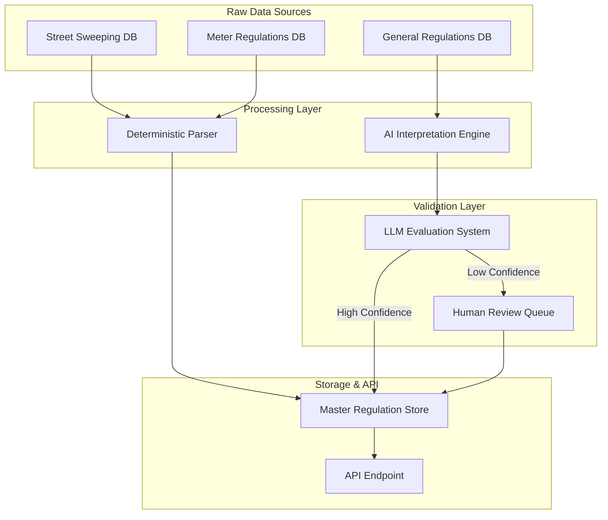

# Hybrid Parking Regulation Interpretation System

## Executive Summary

This document outlines a **Hybrid Interpretation Architecture** for the San Francisco Parking Data system. While high-confidence data sources like **Street Sweeping** and **Meter Regulations** are processed deterministically, the **General Parking Regulations** dataset contains highly unstructured text that requires a probabilistic approach.

We leverage Large Language Models (LLMs) specifically to decode ambiguous text (e.g., "Oversized vehicles..."), while maintaining rigid, code-based parsing for structured data. To ensure reliability, we introduce an **LLM Evaluation System** where a "Judge" model validates the interpretations of "Worker" models.

## Problem Statement

### The Data Dichotomy

1.  **Structured Data (Deterministic)**
    *   **Street Sweeping:** Structured fields (`day`, `from_hour`, `to_hour`, `week_of_month`).
    *   **Meters:** Structured fields (`rate`, `time_limit`, `active_hours`).
    *   *Solution:* Deterministic parsing logic (Code).

2.  **Unstructured Data (Probabilistic)**
    *   **General Regulations:** Free-text fields (`regulation_text`) containing complex legal language.
    *   *Example:* "Oversized vehicles and trailers are those longer than 22 feet or taller than 7 feet" (Is this a ban? A definition? A permit zone?).
    *   *Solution:* Probabilistic AI Interpretation (LLM).

### Key Challenges with Unstructured Regulations
*   **Ambiguity:** "NO STOPPING ANYTIME" vs "NO PARKING" (Legal difference).
*   **Compound Rules:** "2 HR PARKING 9AM-6PM MON-SAT EXCEPT PERMIT W".
*   **Definitions vs. Rules:** Text that defines a vehicle type without explicitly stating the restriction.

## Solution Architecture

### System Overview



### Component 1: Deterministic Parser
*   **Input:** Raw Street Sweeping & Meter rows.
*   **Logic:** Standard Python datetime/regex parsing.
*   **Output:** Standardized `Restriction` objects.
*   **Confidence:** 100% (or Error).

### Component 2: AI Interpretation Engine
*   **Input:** `regulation_text` from General Regulations.
*   **Logic:** LLM (Claude 3.5 Sonnet / GPT-4o) prompting.
*   **Output:** `InterpretedRestriction` objects with `confidence_score`.

### Component 3: LLM Evaluation System (The "Judge")
*   **Role:** Automated QA for AI interpretations.
*   **Mechanism:** A separate, stronger prompt (or model) that "grades" the interpretation against the raw text.

## AI Interpretation Engine Design

### 1. The "Worker" Prompt
The Worker is responsible for the initial translation of raw text into a structured JSON format.

**Input:**
> "Oversized vehicles and trailers are those longer than 22 feet or taller than 7 feet"

**Output Structure:**
```json
{
  "action": "prohibited",
  "summary": "No oversized vehicles (over 22ft long or 7ft tall)",
  "conditions": {
    "days": ["Mon", "Tue", "Wed", "Thu", "Fri", "Sat", "Sun"],
    "time_range": "00:00-23:59",
    "exceptions": []
  },
  "severity": "high",
  "priority": 3
}
```

### 2. The "Judge" Evaluation System
To ensure safety and accuracy, we implement a "Judge" system.

**The Workflow:**
1.  **Worker** generates an interpretation.
2.  **Judge** receives:
    *   Original Text
    *   Worker's Interpretation
3.  **Judge** evaluates on key criteria:
    *   *Accuracy:* Does the summary match the rule?
    *   *Safety:* Did the worker miss a critical condition (e.g., "Tow Away")?
    *   *Hallucination:* Did the worker invent details?

**Judge Output:**
```json
{
  "score": 0.95,
  "reasoning": "Accurate interpretation. Correctly identified dimensions and prohibition.",
  "flagged": false
}
```

**Thresholds:**
*   **Score > 0.9:** Auto-approve.
*   **Score < 0.9:** Flag for Human Review.

## Integration Schema

The AI-interpreted data is appended to the restriction object in the Master Join.

```javascript
{
  "cnn": "1234000",
  // ...
  "restrictions": [
    {
      // Deterministic Data
      "type": "general_regulation",
      "source_text": "Oversized vehicles and trailers...",
      
      // AI-Interpreted Data (Probabilistic)
      "interpreted": {
        "action": "prohibited",
        "summary": "No oversized vehicles (over 22 feet long or 7 feet tall)",
        "details": "Oversized vehicles and trailers are not permitted to park here at any time.",
        "conditions": {
           "days": "All days",
           "hours": "All times"
        },
        "severity": "high",
        "confidence_score": 0.98,
        "judge_verified": true
      }
    }
  ]
}
```

## Implementation Plan

### Phase 1: Judge System Setup (Week 1)
- [ ] Create `Worker` prompt for regulation interpretation.
- [ ] Create `Judge` prompt for evaluation.
- [ ] Build a test set of 50 challenging regulations.
- [ ] Tune prompts until Judge agrees with Human baseline > 90%.

### Phase 2: Pipeline Integration (Week 2)
- [ ] Integrate `RestrictionInterpreter` into `create_master_cnn_join.py`.
- [ ] Implement caching layer (Redis/JSON) to avoid re-interpreting identical strings.
- [ ] Run full batch processing on Mission District data.

### Phase 3: Validation (Week 3)
- [ ] Review low-confidence items flagged by Judge.
- [ ] Verify frontend display of hybrid data (Deterministic + Interpreted).