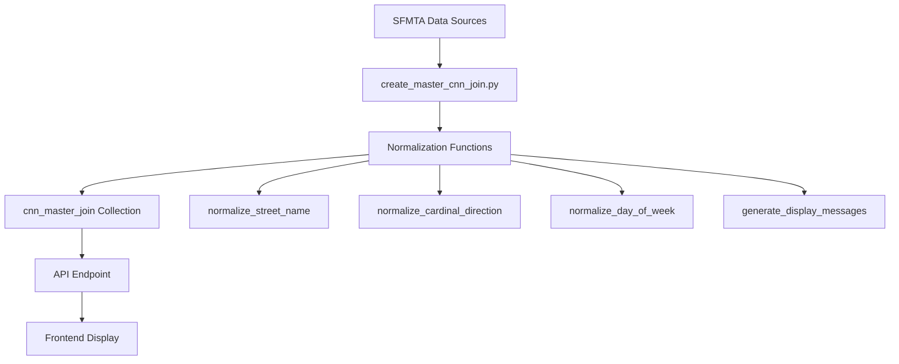

# User-Friendly Display Messages - Implementation Plan

## Executive Summary

This document outlines the complete implementation plan for adding user-friendly display messages to the parking application. The implementation includes:

1. **Street name normalization** (e.g., "18TH ST" → "18th Street")
2. **Cardinal direction display** (e.g., "L" → "North side")
3. **Address range formatting** (e.g., "3401-3449")
4. **Day of week normalization** (e.g., "Th" → "Thursday")
5. **Terminology updates** ("rules" → "restrictions")
6. **Permit display logic** (only show when permit IS required)

## Key Requirements

### 1. Display Message Format

**Primary Format**: `{Street Name} ({Cardinal Direction} side, {Address Range})`

**Examples**:
- `18th Street (North side, 3401-3449)`
- `Bryant Street (East side, 2800-2898)`
- `Balmy Street (West side, odd numbers)`

### 2. Terminology Changes

- **OLD**: "rules" → **NEW**: "restrictions"
- **Remove**: "No Permit Required" messages
- **Logic**: Only display permit information when a permit IS required

### 3. Normalization Requirements

#### Street Names
- `18TH ST` → `18th Street`
- `BRYANT ST` → `Bryant Street`
- `VAN NESS AVE` → `Van Ness Avenue`

#### Cardinal Directions
- `N` → `North`
- `SE` → `Southeast`
- `L` (when no cardinal) → `L side`

#### Days of Week
- `Th` → `Thursday`
- `Thurs` → `Thursday`
- `Mon` → `Monday`
- `Mon-Fri` → `Monday-Friday`

## Implementation Architecture



## Phase 1: Create Normalization Utility Module

### File: `backend/display_utils.py`

Create a new utility module with all normalization functions:

```python
"""
Display Message Utilities

Provides normalization and formatting functions for user-friendly display
of parking information including street names, cardinal directions, days of week,
and address ranges.
"""

from typing import Optional, Dict


# ============================================================================
# STREET NAME NORMALIZATION
# ============================================================================

def normalize_street_name(street_name: str) -> str:
    """
    Normalize street name to user-friendly format.
    
    Examples:
        "18TH ST" → "18th Street"
        "BRYANT ST" → "Bryant Street"
        "VAN NESS AVE" → "Van Ness Avenue"
        "MCALLISTER ST" → "McAllister Street"
    """
    if not street_name:
        return "Unknown Street"
    
    words = street_name.strip().split()
    formatted_words = []
    
    for i, word in enumerate(words):
        # Handle ordinal numbers (18TH → 18th)
        if word.upper().endswith(('ST', 'ND', 'RD', 'TH')) and len(word) > 2:
            prefix = word[:-2]
            if prefix.isdigit():
                formatted_words.append(prefix + word[-2:].lower())
                continue
        
        # Handle street type abbreviations (last word only)
        if i == len(words) - 1:
            word_upper = word.upper()
            street_types = {
                'ST': 'Street',
                'AVE': 'Avenue',
                'BLVD': 'Boulevard',
                'DR': 'Drive',
                'RD': 'Road',
                'LN': 'Lane',
                'CT': 'Court',
                'PL': 'Place',
                'WAY': 'Way',
                'TER': 'Terrace',
                'CIR': 'Circle',
                'PKWY': 'Parkway'
            }
            if word_upper in street_types:
                formatted_words.append(street_types[word_upper])
                continue
        
        # Handle special capitalization
        word_lower = word.lower()
        if word_lower.startswith('mc') and len(word) > 2:
            formatted_words.append('Mc' + word[2:].capitalize())
        elif "'" in word:
            parts = word.split("'")
            formatted_words.append("'".join([p.capitalize() for p in parts]))
        else:
            formatted_words.append(word.capitalize())
    
    return ' '.join(formatted_words)


# ============================================================================
# CARDINAL DIRECTION NORMALIZATION
# ============================================================================

def normalize_cardinal_direction(direction: Optional[str]) -> Optional[str]:
    """
    Normalize cardinal direction to full name.
    
    Examples:
        "N" → "North"
        "SE" → "Southeast"
        "NORTH" → "North"
    """
    if not direction:
        return None
    
    direction_map = {
        'N': 'North',
        'S': 'South',
        'E': 'East',
        'W': 'West',
        'NE': 'Northeast',
        'NW': 'Northwest',
        'SE': 'Southeast',
        'SW': 'Southwest',
        'NORTH': 'North',
        'SOUTH': 'South',
        'EAST': 'East',
        'WEST': 'West',
        'NORTHEAST': 'Northeast',
        'NORTHWEST': 'Northwest',
        'SOUTHEAST': 'Southeast',
        'SOUTHWEST': 'Southwest'
    }
    
    direction_upper = direction.strip().upper()
    return direction_map.get(direction_upper, direction)


# ============================================================================
# DAY OF WEEK NORMALIZATION
# ============================================================================

def normalize_day_of_week(day: Optional[str]) -> Optional[str]:
    """
    Normalize day of week to full name.
    
    Examples:
        "Th" → "Thursday"
        "Thurs" → "Thursday"
        "Mon" → "Monday"
        "TUES" → "Tuesday"
    """
    if not day:
        return None
    
    day_clean = day.strip().upper()
    
    day_map = {
        # Monday
        'M': 'Monday',
        'MON': 'Monday',
        'MONDAY': 'Monday',
        
        # Tuesday
        'TU': 'Tuesday',
        'TUE': 'Tuesday',
        'TUES': 'Tuesday',
        'TUESDAY': 'Tuesday',
        
        # Wednesday
        'W': 'Wednesday',
        'WED': 'Wednesday',
        'WEDNESDAY': 'Wednesday',
        
        # Thursday
        'TH': 'Thursday',
        'THU': 'Thursday',
        'THUR': 'Thursday',
        'THURS': 'Thursday',
        'THURSDAY': 'Thursday',
        
        # Friday
        'F': 'Friday',
        'FRI': 'Friday',
        'FRIDAY': 'Friday',
        
        # Saturday
        'SA': 'Saturday',
        'SAT': 'Saturday',
        'SATURDAY': 'Saturday',
        
        # Sunday
        'SU': 'Sunday',
        'SUN': 'Sunday',
        'SUNDAY': 'Sunday'
    }
    
    return day_map.get(day_clean, day)


def normalize_day_range(day_range: Optional[str]) -> Optional[str]:
    """
    Normalize day ranges like "Mon-Fri" to "Monday-Friday".
    
    Examples:
        "Mon-Fri" → "Monday-Friday"
        "Th-Sat" → "Thursday-Saturday"
        "M-F" → "Monday-Friday"
    """
    if not day_range:
        return None
    
    # Handle various dash types
    for dash in ['-', '–', '—']:
        if dash in day_range:
            parts = day_range.split(dash)
            if len(parts) == 2:
                start_day = normalize_day_of_week(parts[0])
                end_day = normalize_day_of_week(parts[1])
                if start_day and end_day:
                    return f"{start_day}-{end_day}"
    
    # Single day
    return normalize_day_of_week(day_range)


def normalize_day_list(day_list: Optional[str]) -> Optional[str]:
    """
    Normalize comma-separated day lists.
    
    Examples:
        "Mon, Wed, Fri" → "Monday, Wednesday, Friday"
        "Th, Sat" → "Thursday, Saturday"
    """
    if not day_list:
        return None
    
    days = [d.strip() for d in day_list.split(',')]
    normalized_days = [normalize_day_of_week(d) for d in days if d]
    normalized_days = [d for d in normalized_days if d]
    
    if normalized_days:
        return ', '.join(normalized_days)
    
    return day_list


# ============================================================================
# ADDRESS RANGE FORMATTING
# ============================================================================

def format_address_range(
    from_address: Optional[str],
    to_address: Optional[str],
    side_code: Optional[str] = None
) -> str:
    """
    Format address range for display.
    
    Examples:
        ("3401", "3449", "L") → "3401-3449"
        ("3400", "3448", "R") → "3400-3448"
        (None, None, "L") → ""
    """
    if not from_address or not to_address:
        return ""
    
    try:
        int(from_address)
        int(to_address)
        return f"{from_address}-{to_address}"
    except (ValueError, TypeError):
        return ""


# ============================================================================
# DISPLAY MESSAGE GENERATION
# ============================================================================

def generate_display_messages(
    street_name: str,
    side_code: str,
    cardinal_direction: Optional[str],
    from_address: Optional[str],
    to_address: Optional[str]
) -> Dict[str, str]:
    """
    Generate all display message variants for a street segment side.
    
    Args:
        street_name: Raw street name from dataset (e.g., "18TH ST")
        side_code: "L" or "R"
        cardinal_direction: Cardinal direction if available (e.g., "N", "North")
        from_address: Starting address (e.g., "3401")
        to_address: Ending address (e.g., "3449")
    
    Returns:
        Dictionary with display message variants:
        {
            'display_name': "18th Street (North side, 3401-3449)",
            'display_name_short': "18th Street (North side)",
            'display_address_range': "3401-3449",
            'display_cardinal': "North side"
        }
    """
    # Normalize components
    formatted_street = normalize_street_name(street_name)
    normalized_cardinal = normalize_cardinal_direction(cardinal_direction)
    address_display = format_address_range(from_address, to_address, side_code)
    
    # Determine cardinal display
    if normalized_cardinal:
        cardinal_display = f"{normalized_cardinal} side"
    else:
        cardinal_display = f"{side_code} side"
    
    # Generate full display name
    if normalized_cardinal and address_display:
        display_name = f"{formatted_street} ({cardinal_display}, {address_display})"
    elif normalized_cardinal:
        display_name = f"{formatted_street} ({cardinal_display})"
    elif address_display:
        display_name = f"{formatted_street} ({side_code} side, {address_display})"
    else:
        display_name = f"{formatted_street} ({side_code} side)"
    
    # Generate short display name
    display_name_short = f"{formatted_street} ({cardinal_display})"
    
    return {
        'display_name': display_name,
        'display_name_short': display_name_short,
        'display_address_range': address_display or '',
        'display_cardinal': cardinal_display
    }


# ============================================================================
# RESTRICTION FORMATTING
# ============================================================================

def format_restriction_description(
    restriction_type: str,
    day: Optional[str] = None,
    start_time: Optional[str] = None,
    end_time: Optional[str] = None,
    time_limit: Optional[int] = None,
    permit_area: Optional[str] = None
) -> str:
    """
    Format a parking restriction for user-friendly display.
    
    Examples:
        ("street-sweeping", "Th", "8:00 AM", "10:00 AM") 
            → "Street Cleaning Thursday 8:00 AM-10:00 AM"
        
        ("time-limit", None, "9:00 AM", "6:00 PM", 120) 
            → "2 Hour Limit 9:00 AM-6:00 PM"
        
        ("rpp-zone", None, None, None, None, "W") 
            → "Permit Required (Area W)"
    """
    # Normalize day if provided
    normalized_day = normalize_day_of_week(day) if day else None
    
    # Format based on restriction type
    if restriction_type == "street-sweeping":
        day_str = normalized_day or "Unknown Day"
        time_str = f"{start_time}-{end_time}" if start_time and end_time else ""
        return f"Street Cleaning {day_str} {time_str}".strip()
    
    elif restriction_type == "time-limit":
        if time_limit:
            hours = time_limit // 60
            minutes = time_limit % 60
            if hours > 0 and minutes > 0:
                limit_str = f"{hours} Hour {minutes} Minute Limit"
            elif hours > 0:
                limit_str = f"{hours} Hour Limit"
            else:
                limit_str = f"{minutes} Minute Limit"
        else:
            limit_str = "Time Limit"
        
        time_str = f"{start_time}-{end_time}" if start_time and end_time else ""
        return f"{limit_str} {time_str}".strip()
    
    elif restriction_type == "rpp-zone" or restriction_type == "permit":
        if permit_area:
            return f"Permit Required (Area {permit_area})"
        return "Permit Required"
    
    elif restriction_type == "no-parking":
        time_str = f"{start_time}-{end_time}" if start_time and end_time else ""
        day_str = normalized_day or ""
        return f"No Parking {day_str} {time_str}".strip()
    
    elif restriction_type == "tow-away":
        time_str = f"{start_time}-{end_time}" if start_time and end_time else ""
        return f"Tow-Away Zone {time_str}".strip()
    
    else:
        return restriction_type.replace('-', ' ').title()
```

## Phase 2: Update Master Join Creation Script

### Modifications to `create_master_cnn_join.py`

Add import and use the new utility functions:

```python
from display_utils import (
    normalize_street_name,
    normalize_cardinal_direction,
    normalize_day_of_week,
    generate_display_messages
)

# In the main() function, after building base records:
for cnn, record in cnn_master.items():
    street_name = record["street_name"]
    
    # Generate display messages for left side
    left_display = generate_display_messages(
        street_name=street_name,
        side_code="L",
        cardinal_direction=record["left_side"]["cardinal_direction"],
        from_address=record["left_side"]["from_address"],
        to_address=record["left_side"]["to_address"]
    )
    record["left_side"].update(left_display)
    
    # Generate display messages for right side
    right_display = generate_display_messages(
        street_name=street_name,
        side_code="R",
        cardinal_direction=record["right_side"]["cardinal_direction"],
        from_address=record["right_side"]["from_address"],
        to_address=record["right_side"]["to_address"]
    )
    record["right_side"].update(right_display)
```

## Phase 3: Update Database Schema

### Updated `cnn_master_join` Collection Schema

```javascript
{
  "cnn": "1234000",
  "cnn_left": "1234000_L",
  "cnn_right": "1234000_R",
  
  "street_name": "18TH ST",  // Original from dataset
  "from_street": "York St",
  "to_street": "Bryant St",
  
  "left_side": {
    "side_code": "L",
    "cardinal_direction": "North",
    "from_address": "3401",
    "to_address": "3449",
    
    // NEW: Display message fields
    "display_name": "18th Street (North side, 3401-3449)",
    "display_name_short": "18th Street (North side)",
    "display_address_range": "3401-3449",
    "display_cardinal": "North side",
    
    "blockface_id": "GlobalID-123",
    "geometry": { /* GeoJSON */ },
    "centroid": { /* Point */ }
  },
  
  "right_side": {
    "side_code": "R",
    "cardinal_direction": "South",
    "from_address": "3400",
    "to_address": "3448",
    
    // NEW: Display message fields
    "display_name": "18th Street (South side, 3400-3448)",
    "display_name_short": "18th Street (South side)",
    "display_address_range": "3400-3448",
    "display_cardinal": "South side",
    
    "blockface_id": "GlobalID-456",
    "geometry": { /* GeoJSON */ },
    "centroid": { /* Point */ }
  },
  
  // Restrictions (formerly "rules")
  "restrictions": [
    {
      "type": "street-sweeping",
      "side": "L",
      "day": "Thursday",  // Normalized from "Th"
      "startTime": "8:00 AM",
      "endTime": "10:00 AM",
      "description": "Street Cleaning Thursday 8:00 AM-10:00 AM"
    },
    {
      "type": "rpp-zone",
      "side": "L",
      "permitArea": "W",
      "description": "Permit Required (Area W)"
    }
  ],
  
  "centerline_geometry": { /* LineString */ },
  "neighborhood": "Mission",
  "zip_code": "94110",
  "supervisor_district": "9",
  "data_sources": ["active_streets", "blockface_geometries", "street_cleaning"],
  "created_at": ISODate("2025-11-28"),
  "version": 1
}
```

## Phase 4: Update API Response

### Modified `main.py` API Endpoint

```python
@app.get("/api/v1/blockfaces", response_model=List[dict])
async def get_blockfaces(lat: float, lng: float, radius_meters: int = 500):
    """
    Get street segments with user-friendly display messages.
    """
    try:
        earth_radius_meters = 6378100
        radius_radians = radius_meters / earth_radius_meters

        # Query cnn_master_join collection
        query = {
            "$or": [
                {
                    "left_side.centroid": {
                        "$geoWithin": {
                            "$centerSphere": [[lng, lat], radius_radians]
                        }
                    }
                },
                {
                    "right_side.centroid": {
                        "$geoWithin": {
                            "$centerSphere": [[lng, lat], radius_radians]
                        }
                    }
                }
            ]
        }
        
        segments = []
        async for doc in db.cnn_master_join.find(query):
            # Return both left and right sides as separate segments
            for side_key in ["left_side", "right_side"]:
                side_data = doc.get(side_key, {})
                if not side_data.get("geometry"):
                    continue
                
                segment_response = {
                    "id": f"{doc['cnn']}_{side_data['side_code']}",
                    "cnn": doc["cnn"],
                    "side": side_data["side_code"],
                    
                    # Display messages
                    "display_name": side_data.get("display_name"),
                    "display_name_short": side_data.get("display_name_short"),
                    "display_address_range": side_data.get("display_address_range"),
                    "display_cardinal": side_data.get("display_cardinal"),
                    
                    # Raw data (for compatibility)
                    "street_name": doc.get("street_name"),
                    "from_street": doc.get("from_street"),
                    "to_street": doc.get("to_street"),
                    "from_address": side_data.get("from_address"),
                    "to_address": side_data.get("to_address"),
                    "cardinal_direction": side_data.get("cardinal_direction"),
                    
                    # Geometry
                    "geometry": side_data.get("geometry"),
                    
                    # Restrictions (filtered for this side, with normalized days)
                    "restrictions": [
                        r for r in doc.get("restrictions", [])
                        if r.get("side") == side_data["side_code"]
                    ],
                    
                    # Schedules
                    "schedules": doc.get("schedules", [])
                }
                
                segments.append(segment_response)
        
        return segments
        
    except Exception as e:
        print(f"Error in get_blockfaces: {e}")
        import traceback
        traceback.print_exc()
        raise HTTPException(status_code=500, detail=str(e))
```

## Phase 5: Frontend Updates

### Display Message Usage

```typescript
// Map Popup - Use full display name
<h3>{segment.display_name}</h3>
// "18th Street (North side, 3401-3449)"

// List View - Use short display name
<li>{segment.display_name_short}</li>
// "18th Street (North side)"

// Restrictions Section - Use normalized data
<div className="restrictions">
  <h4>Parking Restrictions</h4>
  {segment.restrictions.map((restriction, idx) => (
    <div key={idx} className="restriction-item">
      <p>{restriction.description}</p>
      {/* Only show permit info if permit IS required */}
      {restriction.type === 'rpp-zone' && (
        <span className="permit-badge">
          Permit Required (Area {restriction.permitArea})
        </span>
      )}
    </div>
  ))}
</div>
```

### Terminology Updates

Update all instances of:
- `rules` → `restrictions`
- `segment.rules` → `segment.restrictions`
- "Parking Rules" → "Parking Restrictions"

## Phase 6: Testing Plan

### Test Cases

#### 1. Street Name Normalization
```
Input: "18TH ST" → Expected: "18th Street"
Input: "BRYANT ST" → Expected: "Bryant Street"
Input: "VAN NESS AVE" → Expected: "Van Ness Avenue"
Input: "MCALLISTER ST" → Expected: "McAllister Street"
```

#### 2. Day of Week Normalization
```
Input: "Th" → Expected: "Thursday"
Input: "Thurs" → Expected: "Thursday"
Input: "Mon-Fri" → Expected: "Monday-Friday"
Input: "Th, Sat" → Expected: "Thursday, Saturday"
```

#### 3. Display Messages
```
Test: 18th Street, North side, 3401-3449
Expected: "18th Street (North side, 3401-3449)"

Test: Balmy Street, West side, no addresses
Expected: "Balmy Street (West side)"

Test: Bryant Street, L side (no cardinal), 2800-2898
Expected: "Bryant Street (L side, 2800-2898)"
```

#### 4. Permit Display Logic
```
Test: No permit required
Expected: No permit message displayed

Test: Permit required (Area W)
Expected: "Permit Required (Area W)" displayed
```

## Implementation Timeline

### Week 1: Foundation
- [ ] Create `display_utils.py` with all normalization functions
- [ ] Write unit tests for normalization functions
- [ ] Update `create_master_cnn_join.py` to use new utilities

### Week 2: Database & API
- [ ] Run master join creation for Mission neighborhood
- [ ] Verify data quality and display messages
- [ ] Update API endpoint to query `cnn_master_join`
- [ ] Update API response model

### Week 3: Frontend & Testing
- [ ] Update frontend components to use display messages
- [ ] Change terminology from "rules" to "restrictions"
- [ ] Remove "No Permit Required" display logic
- [ ] Test with real data (18th St, Balmy St, Bryant St)

### Week 4: Documentation & Deployment
- [ ] Create migration guide
- [ ] Document all changes
- [ ] Deploy to production
- [ ] Monitor for issues

## Success Criteria

✅ All street names display in proper format (e.g., "18th Street")
✅ Cardinal directions show full names (e.g., "North side")
✅ Days of week are fully spelled out (e.g., "Thursday")
✅ Address ranges display correctly (e.g., "3401-3449")
✅ "Restrictions" terminology used throughout
✅ Permit info only shown when permit IS required
✅ API response time < 100ms
✅ 100% test coverage for normalization functions

## References

- Master CNN Join Design: [`MASTER_CNN_JOIN_DATABASE_DESIGN.md`](MASTER_CNN_JOIN_DATABASE_DESIGN.md)
- Cardinal Directions Summary: [`CARDINAL_DIRECTIONS_AND_MASTER_JOIN_SUMMARY.md`](CARDINAL_DIRECTIONS_AND_MASTER_JOIN_SUMMARY.md)
- Normalization Spec: [`DISPLAY_MESSAGE_NORMALIZATION_SPEC.md`](DISPLAY_MESSAGE_NORMALIZATION_SPEC.md)